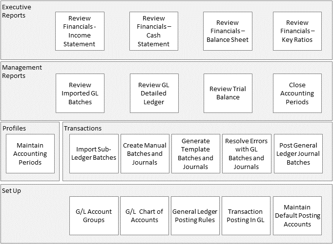

## Introduction & Overview  
___  

The General Ledger Process contains all the functions that you need to process all transactions that 
occur between your company and all its stakeholders.  The module includes all the reports you need to 
geneate comprehensive financial statements and audit trails to keep on top of all the company's finances.

The functions in the General Ledger module can be best described in the following flowchart.  

  

You can access the step by step guides and video demonstrations for each function from the
list below.

:::note Terms: Process & Module

We use the term "**Process**" to describe the work that must be done in a specific area of your business
and the term "**Module**" to refer to the set of functions in the Sense-i software that allows you to perform
that work.  

:::

:::note Background Information
To better understand the flowchart please read the **Business PowerPoint, Levels of Work,** and
**Understanding Function Types** documents. These documents provide essential background information
to understanding how the work and information in your business and the Sense-i system is structured.

:::  

___
## Functions in the module  

The General Ledger module contains the following functions;  

### Profile Functions
The profile function enable you to maintain information about the Accounting Periods to which transactions are posted.

- Maintain Accounting Periods 

___
### Transactions
The transactions in the General Ledger module enable you to retrieve all the transactions captured in the various 
sub-ledgers and post and manage these in the General Ledger. 

The transactions in this module are:

- Import Sub-Ledger Batches

- Create Manual Batches and Journals

- Generate Template Batches and Journals

- Resolve Errors with GL Batches and Journals

- Post General Ledger Journal Batches

___
### Report Functions
The report functions in the system fall into two groups. **Management Reports** 
help with the daily workflow and focus on what transactions need to be processed,
while **Executive Reports** enable you to review the all information related to
the Financial Statements of the company.
___
### Management Reports

- Review Imported GL Batches

- Review GL Detailed Ledger 

- Review Trial Balance 

- Close Accounting Periods 

___
### Executive Reports

- Review Financials - Income Statements

- Review Financials – Cash Statements

- Review Financials – Balance Sheet

- Review Financials – Key Ratios

___
:::note Detailed Step-by-Step Procedures

Detailed Step-by-Step procedures and video guides exist for each of the
functions in this module that will explain every action you need to take
to successfully capture and work with the information in the system.

Simply click on any of the functions above to access the detailed
Step-by-Step instruction.

:::

___
### Setup Functions

To use the functions in the module, key information needs to be entered
into the system.  The setup functions allow you to enter this information
which changes very rarely. The setup functions are:

- GL Account Groups 

- G/L  Chart of Accounts 

- General Ledger Posting Rules 

- Transaction Posting In G/L

- Maintain Default Posting Accounts 

___
## Related Modules  

The General Ledger module works with the following modules:

-   Accounts Payable Process

-   Accounts Receivable Process

-   Cashbook Management Process

**This is the end of the module overview.**
