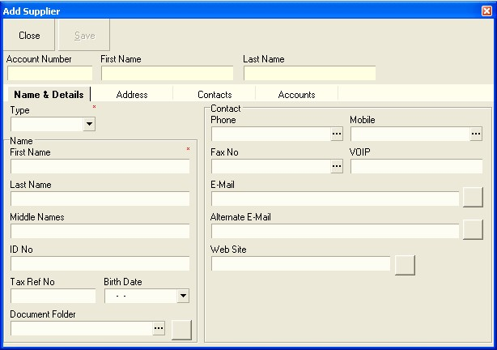
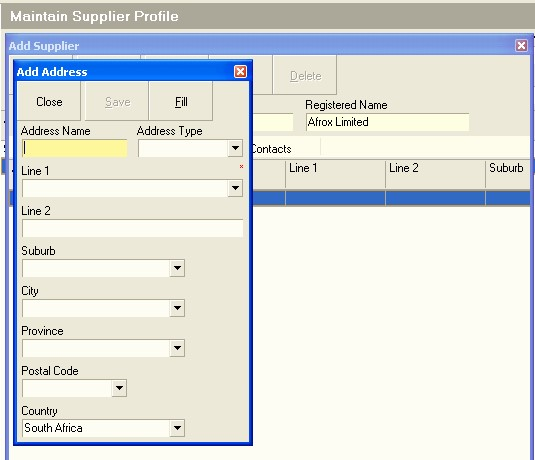
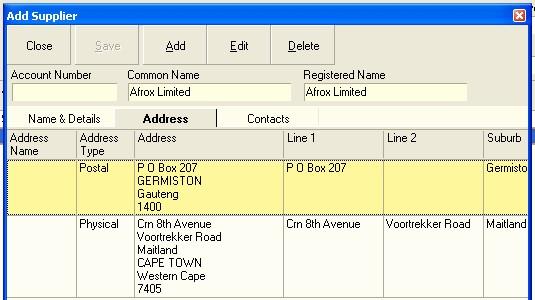
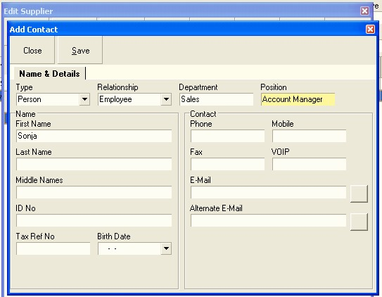
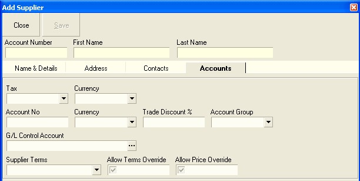

## Procedure Guideline
___  

This procedure describes how to add the names of new suppliers and
their details to the Sense-i Enterprise Management System.

1.  Click on the Supplier item on the main menu.

2.  Click on the Supplier item from the drop down list.  

The system will display a screen titled Maintain Supplier. This screen
lists all of the companies that have been classified as Suppliers in
the system.

_(The first time you enter this screen it will not have any
information to list so the grid will be empty.)_

3.  Click on the Add Button on the Form Bar.

4.  The system will display a screen titled Add Supplier.

  

You will notice that this screen contains four tab sheets. Name &
Details, Address, Contacts and Accounts. You enter information about
the Supplier in the fields on each of these Tab sheets.

5.  The Add Supplier screen provides a series of blank fields that will
    enable you to record basic information about the supplier, such as
    their Name, their Registered Name and Registration Number, Tax
    Number and contact details. To add a Supplier it is necessary to
    complete these fields. The more complete and accurate the
    information you enter into the system, the better the system will
    function.

6.  First, you need to define whether the Supplier you are adding to the
    database is a Person or an Organisation. Select the appropriate
    option from the drop down list.

7.  If the supplier is an organisation, capture the Common or Short Name
    in the Common Name field. If the supplier is an individual, capture
    their First Name in the First Name field.

8.  If the supplier is an organisation, capture the Registered Name in
    the Registered Name field or if the supplier is an individual,
    capture their Last Name and then Middle Name in the next two fields.

9.  Enter the Supplier's Registration Number in the ID Number field.

10. Enter the Supplier's Tax Number in the VAT Number field.

11. Capture or Set the Registration Date, that is the date on which the
    Supplier's company was registered.

12. Click on the three-dot button and select a folder that is shared
    across the network. This folder will be used by the system to store
    communication, proposals, word documents and PDF Files such as
    Purchase Orders and Supplier Claim forms that are created for this
    supplier in the system.

13. Enter the main phone number for the Supplier in the Phone Number
    field.

14. Enter the mobile number of the primary contact for the Supplier in
    the Mobile Number field.

15. Enter the Fax Number in the Fax Number field.

16. If you use the internet to communicate with the supplier using an
    application like Skype, enter the supplier's VOIP Number / Name in
    this field.

17. Enter the Primary Email Address.

18. Enter any Second Email Address.

19. Enter the Website Address for the supplier in the Website Address
    field.

20. Once you have entered the necessary and available information, you
    should click on the Save button on the Add Supplier screen to save
    this information to the database.

21. Click the Address Tab to add Addresses for the Supplier.

  

22. The system will display a window titled that enables you to store
    various a Physical, Postal and Shipping Addresses for each supplier.

23. To add an address for the supplier to the database, click the Add
    button on the Add Supplier screen.

24. The system will open a screen titled Add Address.  

  

25. You can enter a name for the address you are capturing.  

26. Choose the Address Type from the Drop Down List.  

27. Enter the Street / P.O. Box address. You can do this over two lines.  

28. Enter the Suburb.  

29. Enter the City.  

30. Enter the State or Province in which the Supplier is located.  

31. Enter the Zip or Postal Code for the Supplier.  

32. Select the Country.  

33. The system maintains a list of all suburbs, cities, provinces and
    postal codes for the country. When you have entered sufficient
    information for the system to find a unique match, you can click the
    Fill button and the system will complete the address with the
    correct information.

34. Click the Save button once you have completely entered the address
    and then click the Close button.

35. If you need to create additional addresses for the Supplier then
    repeat steps 22 to 34 for each address you need to load.

36. The system will display each address you have added in a list of
    addresses on the Address Tab.  

  

37. Once you have completed adding the Addresses for the Supplier, you
    can add as many contacts as you need. You can add as many contacts
    as you wish to each supplier.  

38. Simply click on the Contacts tab to view a list of all of the
    Contacts that have been defined for the selected supplier.  
	
  

39. To add a contact to the supplier, click the Add button.

40. The system will display a screen titled Add Contact. Simply enter as
    much information as you need about the contact in the fields on this
    screen.

The system will open the Add Contact screen. This screen enables you
to enter all of the information you might need to maintain accurate
and complete contact records.

  

41. When you have completed entering details for the contact, click the
    Save button.

42. You can repeat steps 39 to 41 for each contact you need to add for
    the supplier.

43. Once you have added all the Contacts for the Supplier, click the
    Accounts Tab.

  

44. Set a default Tax Rate for use on all the transactions you capture
    for the supplier. You can override this when capturing the actual
    transactions.  

45. Select the Currency in which the tax is recorded from the drop down
    currency list.  

46. Enter an Account Number for the Supplier in the Account Number
    field.  

47. Select the Currency in which your company will transact with the
    Supplier.  

48. Enter a default trade discount that is used when placing orders with
    the supplier if one applies.  

49. Select the Currency in which your company will transact with the
    Supplier.  

50. Assign the supplier to a Supplier Group. This field lists all the
    Supplier Groups that have been defined in the system. The Supplier
    Group function allows you to assign the specific Supplier to one of
    the groups you have defined. These groupings allow you to analyse
    your purchases and expenditure at a higher level than individual
    suppliers. You could use groupings such a Local, Foreign, BEE
    Approved, Non-BEE and so on to group your suppliers, or you could
    group them according to the type of Industry in which they operate.  

51. Select the Payment Terms on which this Supplier sells materials or
    machines to your company from the drop down list of terms available.
    If you do not find the right set of terms in this list, go to the
    procedure titled Define Account Terms.  

52. If you are going to allow the people who capture Purchase Orders to
    use different terms for this Supplier when creating Orders check the
    Allow Terms Over-ride box.  

53. If you are going to allow the people who will be capturing Purchase
    Orders to change the Material Cost Price of the items that appear on
    the Purchase Order, then check the Allow Price Over-ride box.  

54. Select the method by which you will check the Credit Available from
    the Supplier. You can either check that you have sufficient Credit
    Available when capturing the Order (i.e. upfront) or before the
    Supplier delivers the items. The terms method depends on the terms
    granted by the Supplier to your company.  

55. Once you have completed adding contact information, click the Close
    button.  

56. You have now set-up the supplier's profile. This information you
    have entered will appear on the Supplier Transaction forms such as
    Purchase Orders, GRVs, claim forms and similar documents.  

57. You can now search for the Supplier on the Maintain Supplier List
    screen using the Search fields at the top of the screen.  

58. Repeat this procedure for each supplier you need to add to the
    system.  

**This is the end of this procedure.**
