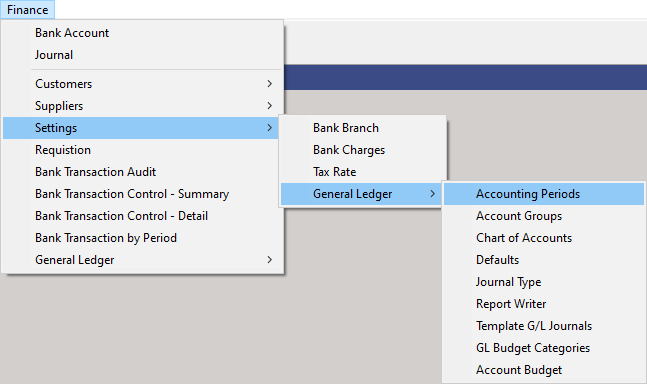
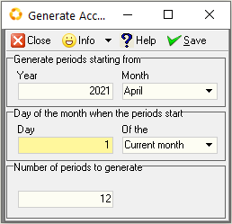
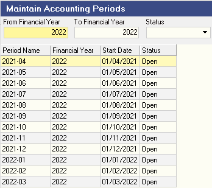

## Step-by-step Guideline  
___  

1.  Click on the **Finance** option on the Main Menu.

2.  Then click the **Settings** menu item on the drop down menu.

3.  Then click **General Ledger** and then **Accounting Periods**.

  

The system will open a screen titled **"Maintain Accounting Periods."**  
This screen lists all of the Accounting Periods that have been defined
in the General Ledger. The first time you enter this screen it will be
blank, unless of course you defined the Accounting Periods when
installing the system.  

  

5.  Click the **Generate** button on the form bar.  

The system will display the **Generate Account Periods** window.  

  

6.  **Set the year** in which the Financial Year you want to add to the
    system starts in the **Year** field.  

7.  Select the **starting month** of the Financial Year from the drop down
    list in the **Month** field.  

8.  **Set the day** on which each Accounting Period within the Financial
    Year begins. This is usually the first of the month.  

9.  If the period starts at the **beginning of a month**, select
	**Current Month** from the drop down list.  
	If the period starts during a **previous month**, for example
	such as the 25th of a month, select
    **Previous Month** from the drop down list.  

10. Define the **number of periods** to generate. This is usually **12**,
	one for each **Calendar Month**.  

11. Click the **Save** button at the top of the Generate Account Periods form.  

The system will generate a set of Accounting Periods according to the
information you entered in the preceding steps and then will display
each of the Accounting Periods it has generated in a list on the
screen.  

  

12. You can repeat the above steps to create Accounting Periods for
    earlier years if you wish to enter historical data, or you can
    create Accounting Periods for the following year if you wish to
    begin entering budgeting information.  

13. When you have completed defining the Accounting Periods for your
    company, click the **Close** button.  

14. The system will close the Maintain Accounting Periods screen.

**This is the end of the procedure.**
