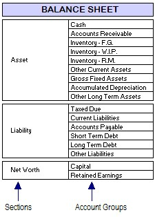
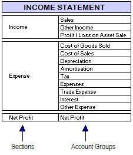
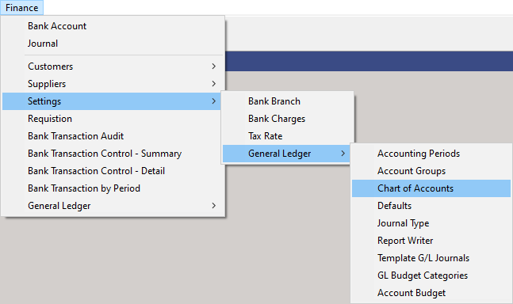
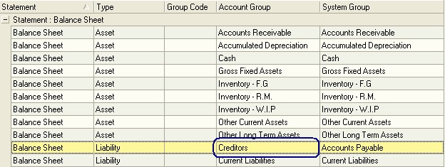

## Outline - Account Groups  
___  

Managing the financial heart of any business requires that the
information about transactions in the business is stored and presented
in a way that allows for easy, yet intelligent analysis.  
Ensuring that financial information is properly structured from the
beginning is central to making this possible.

All General Ledger Systems store and report on a huge number of
individual transaction entries. To provide meaning to all these
individual transactions General Ledgers group and sum financial
information in individual accounts. These accounts are maintained in a
**Chart of Accounts** function.  

In most cases, the number of accounts in the average Chart of Accounts
is lengthy, usually running into the hundreds.  
The problem with so many different accounts is that analysing and
managing the financial performance of a business becomes
un-necessarily complicated and often, while there is an abundance of
information, it is neither practical nor useful for making the right
decisions.  

To solve this problem, the Accounts in the Chart of Accounts are
**arranged** into **Financial Statements**, and within each Financial
Statement, into **specific Account Groups**.

The Account Groups allow you to arrange and analyse the financial
information of your business in a quick and powerful way so that you
can identify and replicate successful areas and at the same time take
the necessary steps to identify and control any variances.

## Financial Statements 

At the top of the structure are the Financial Statements of which
there are three types.
-   Balance Sheet
-   Income Statement
-   Cash Statement  

### Balance Sheet  

The **Balance Sheet** measures the status or structure of property at
a specific time. A Balance Sheet is a "snapshot", like a still
photograph, it a reflects the total balance of assets, money owed by
its customers, money owed to suppliers, employees and financiers and
the difference between the organization's assets and the money it owes
(called the liabilities). This difference is known as the Net Worth of
the organization.

The status or position of a company's financial position on the
balance is the result of the trading (Sales less Expenses) and the
flow of cash (Collections less Payments) in a given period. The
information about a company's trading is reported on an Income
Statement. (This is also sometimes called a Profit and Loss
Statement).  

### Income Statement

The **Income Statement** is a record of Legal Obligations, that is
"promises to pay in the future." It is extremely important to note
that the values reflected on the Income Statement are not a reflection
of the Cash Transactions of an organization.

Sales are promises from the company's customers to pay for the goods
and services they have bought. Expenses are promises by the company to
pay its suppliers for the materials, machinery and facilities it has
purchased. Payroll expenses are promises by the company to pay its
employees for the work they have performed. In addition, the Income
Statement is also a record of how quickly it is utilizing other
assets, such as machinery. The financial values assigned to the
Depreciation record how much value a tangible asset has been lost
through use during a period.  

### Cash Statement  

The **Cash Statement** records the actual flow of money in the
company, that is the value of the payments, receipts, interest charges
and so on, made and received.

When customers actually settle their accounts, the cash they pay
appears as Collections on the company's Cash Statement. When the
company makes actual payments of money to its Employees, Suppliers and
the Government, the value of these payments appear in various Account
Groups on the Cash Statement. The Direct Cash Statement chronicles
what flows in and out of the organization's bank accounts.

The three financial statements provide a complete picture of the
status of a company's financial position and the changes from one date
to another. As such, it is best to think of the three financial
statements using the following illustration...

  

## Account Groups  

Each Financial Statement is broken down into a set of Account Groups
that sum the financial information for similar types of transactions
together. The Account Groups provide a high level view of what is
happening in a business. The Balance Sheet is broken down into three
sections. These are...

-   Assets
-   Liabilities
-   Net Worth _(being the difference between Assets and Liabilities)_

  

Within each of these sections are a set of Account Groups that relate
specifically to the section.  

### Assets

The Assets of a business can be categorised as
follows:  

-   **Cash** (how much money the company has in its bank accounts.)  

-   **Accounts Receivable** (how much money its customers owe for goods and
    services bought.)

-   **Inventory** (how much stock of finished goods, work-in-progress and
    raw materials it has.)

-   **Other Current Assets** (items it owns that can be quickly converted
    into cash.)

-   **Fixed Assets** (the machinery, buildings and equipment it owns.)

-   and finally **Other Assets**.  

### Liabilities  

Similarly, the Liabilities section on the Balance Sheet, (that is what
the company owes other companies and individuals), can be arranged
according to meaningful groups.

-   **Taxes Due** (the amount owed to various tax authorities.)

-   **Current Liabilities** (the amount owed to staff and sundry parties.)

-   **Accounts Payable** (the amount owed to suppliers for goods bought.)

-   **Short Term Debt** (the value of loan payments due in the coming 12
    months)

-   **Long Term Debt** (the value of loans outstanding less the Short Term
    portion).  
	
### Net Worth  

The Net Worth of a company can be arranged into...

-   **Share Capital** (the value of the money invested in the shares of the
    business)  

-   **Retained Earnings** (the value of the historical profit made by the
    company)  
	
The following image illustrates the breakdown of the Balance Sheet
into its sections and Account Groups...

  

## Income Statement  

In a similar way, the Income Statement is broken down into two
sections which themselves are arranged into various Account Groups.

### Income

-   Sales (the value of the goods and services bought by the company's
    customers in a period.)

-   Other Income (the value of money earned from other assets such as
    shares in a period.)

-   Profit on Asset Sale (the profit made on the sale of fixed assets in
    a given period.)

### Expenses

-   Cost of Goods Sold (the cost of the goods and services sold to
    customers in a period.)

-   Cost of Sales (the cost of making and supporting sales in a period.)

-   Depreciation (the cost of machinery and equipment used in a period.)

-   Amortisation (the cost of the use of other assets in a period.)

-   Tax (the value of tax due to be paid in a period.)

-   Expenses (the cost of personnel incurred by a company in a period.)

-   Trade Expenses (the cost of goods and services purchased from
    suppliers in a period.)

-   Interest (the cost of the loans and debt finance used by the company
    in a period.)

-   Other Expenses (the cost of any sundry expenses in a period.)

-   Net Profit (the difference between the income and all the expenses
    in a period.)

The following image illustrates the breakdown of the Income Statement
into its sections and Account Groups...

  

## Cash Statement

The Cash Statement similarly is broken down into three sections each
of which consists of several Account Groups.  

## Custom Account Groups  

The Sense-i General Ledger System allows you to view the Account
Groups and to create customized names for each Account Group if you
need names for Account Groups that are different from the standard
ones included with the system.  

### Create Custom Account Groups

To view and create custom Account Group Names, perform the following steps...

1.  Click on the **Finance** option on the Main Menu.

2.  Then click the **Settings** menu item on the drop down menu.

3.  Then click **General Ledger** and then **Chart of Accounts**.

  

The system will open a screen titled **"Maintain Account Group."**  
This screen lists all of the standard Account Groups that have been
pre-defined in the system.

:::note 
You can search for specific Account Groups using any of the
fields in the Search Criteria Panel at the top of the screen.  
:::

  

4.  To create a custom name for an Account Group, click on the
	**Account Group** for which you wish to create a custom Account Group name

5.  Then click the **Edit** Button at the top of the screen.

The system will open a window titled **"Edit Account Group."**  
You can **enter a code** for the Account Group, **create a custom Account Group Name**
or enter a **Description for the Account Group** in any of the fields on
the screen.

  

6.  You might decide that you wish to see the word "Creditors" on your
    financial statements instead of the term "Accounts Payable." To do
    this, type the Custom Account Group Name you wish to use in the
    Account Group field.

7.  Once you have made the necessary changes, click the **Save** button.

The system will close the Edit Account Group window and return you to
the list of Account Groups.

You will notice that the Custom Account Group Name you have entered
will be displayed in the Account Group column. Notice too that the
original system defined Account Group Name is displayed in the System
Group column.

  

### Reset Custom Account Group Name

8.  If you need to reset the Custom Account Group Names to the original
    ones defined by the system, click the **Reset** Button.

  

9.  Once you have completed working with the Account Groups click the
    **Close** button.

**This is the end of the procedure.**
