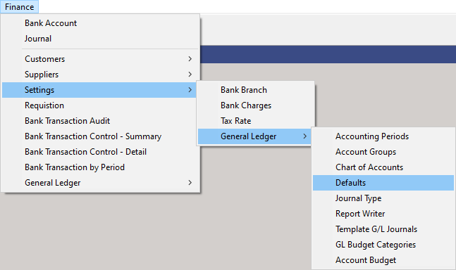
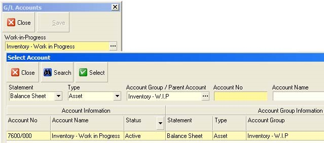

## Step-by-step Guideline  
___ 

1.  Click on the **Finance** option on the Main Menu.

2.  Then click the **Settings** menu item on the drop down menu.

3.  Then click **General Ledger** and select **Defaults**.

  

The system will open a screen titled "**G/L Accounts**."
This screen lists all of the Accounts that have been defined in the
General Ledger.

  

## Setting Up The Default Accounts  

You will set-up each of the Default Accounts in the same way.

This is described in steps 5 to 7 below...

5.  To select an Account to act as the Default Posting Account, click on
    the three dot button in each of the Default Account fields as
    described below.

  

The system will open a window allows you to click on an Account from
your **Chart of Accounts list**.

You can use the any of the **Search Fields** at the top of the screen and
the Quick Filter List described above to filter the list if you need
to do so.

6.  Once you have found the Account you wish to use, click on the
    **appropriate row**.

7.  Then click the **Select** button.

The system will return you to the **Default G/L Account** window and
display the Account Name of the Account you have selected in the
Default Account panel.

You will then repeat these steps for each of the Default Accounts you
need to define for your company.

## Understanding The Purpose Of Each Default Account

### The Work-in-Progress Account 

This is a default account used for storing the financial value of all
materials that are issued from the material stores to process orders.

The balance of the account is increased by the Process Order Issue
transaction, that is materials booked out of the store.

The balance of the account is reduced by the Process Order Issue
Return transaction, that is all materials returned from production (or
operations or construction, depending on your company) to the store.

The balance on the account is also influenced by the value of
materials in completed process orders. As process orders are completed
the balance in the Work-In-Progress account is reduced because by
completing a process order (or job) the materials are moving from
production into a Finished Goods store or to the Customer.

You should set up a Work In Progress on the Balance Sheet in the
Inventory -- Work-in-Progress account and then select this account as
the default.

### Settlement Discount 

This is a default account used for storing the financial value of all
Discount Taken when paying accounts. Any discount journals or
discounts recorded on a payment to a supplier is stored in this
account.

You should set up a Discount Allowed account in the Income Statement
in the Other Income Account Group and then select this account as the
default.

### A/P - POREC Clearing Account 

This is the Accounts Payable -- Purchase Order Receipt Clearing
Account. The term POREC (Purchase Order Receipt) and GRN (Goods
Received Note) are completely interchangeable.

This is a default account used to ensure that the Invoices received
from Suppliers correspond to the Goods Delivered.

The balance on this account is increased by the Purchase Order Receipt
transaction that is created to process deliveries received from
Suppliers. (note that the Purchase Order Receipt transaction is
sometimes known as a Goods Received Note.)

The balance of this account is decreased by the Purchase Order Return
transaction that is created to process any items returned to
suppliers.

In addition, Purchase Order Invoices and Purchase Order Credit Notes
update the balance on this account.

The Purchase Order Invoice will decrease the balance on this account
as it offsets the Purchase Order Receipt values.

The Purchase Order Credit Note will increase the balance on this
account as it offsets the Purchase Order Return transaction.

You should set up a GRN Clearing Account on the Balance Sheet in the
Accounts Payable Account Group and then select this account as the
default.

### A/R - SODN Clearing Account 

This is the Accounts Receivable - Sales Order Delivery Note Clearing
Account.

This is a default account used to ensure that the Customers are
Invoiced for all deliveries made to them.

The balance on this account is increased by the Sales Order Delivery
Note transaction that is created whenever goods are delivered to
customers.

The balance of this account is decreased by the Sales Order Return
transaction that is created to process any items returned by Customers
to the company.

In addition, Sales Order Invoices and Sales Order Credit Notes update
the balance on this account.

The Sales Order Invoice will decrease the balance on this account as
it offsets the Sales Order Delivery Notes values.

The Sales Order Credit Note will increase the balance on this account
as it offsets the Sales Order Return transaction.

You should set up a A/R -- SODN Clearing Account on the Balance Sheet
in the Accounts Receivable Account Group and then select this account
as the default.

### Tax Control Account 

This is a default account used to store the value of the tax component
on all Sales, Purchases and Sundry Bank transactions.

You should set up a default Tax Account on the Balance Sheet in the
Taxes Due Account Group and then select this account as the default.

### Departmental Accounting 

The final default setting for the General Ledger is the Departmental
Accounting. Check this box if your company has more than one factory,
warehouse or retail outlet and you wish to allocate and report on
income and expenditure separately for each department.

Once you have defined the Default Accounts you need, click **Save**
and the **Close**.

The system will Close the Default G/L Accounts screen and return you to
the main screen in the application.

**This is the end of the procedure.**
