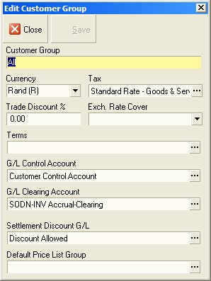
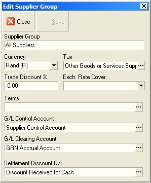
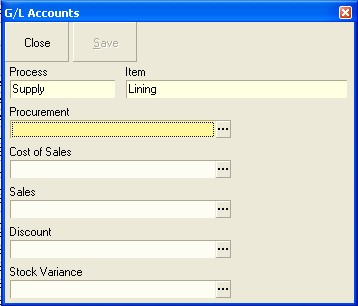
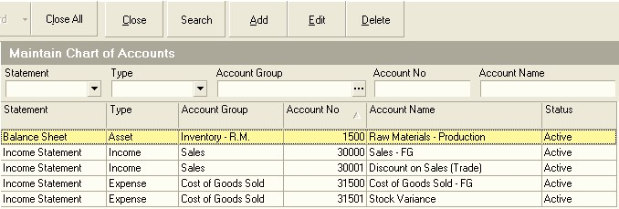
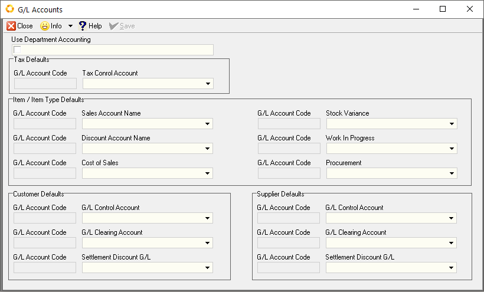

## Procedure Guideline  
___  

Use this procedure to capture details for posting transactions in the
company's General Ledger.

In this procedure you will link various business objects to one or
more accounts in the company's Chart of Accounts as they are defined
in the General Ledger. The system will use the linked accounts to
decide how to post transactions from the various sub-ledgers when they
are imported into the General Ledger.

## The Business Objects 

The system uses the following Business Objects in creating
transactions and recording financial information;

-   **Parties**
	-   Customers, Suppliers, Employees, Financiers and Legislators
-   **Products & Services**
-   **Taxes**
-   **Bank Accounts**  

Before you can set up the Posting Rules for your various Inventory
Items you will need to at least have the following accounts defined in
your General Ledger.
___  
## G/L Posting Rules for Customers 

An **Accounts Receivable Control Account** in the
**Accounts Receivable Account Group** on the **Balance Sheet** to
which the value of all Sales Order Invoices, Sales Order Credit Notes and
Customer Receipts in the Bank Account will be posted.

A **Delivery Note -- Invoice Clearing Account** in the
**Accounts Receivable Account Group** on the **Balance Sheet** to which
the value of all Sales Order Delivery Notes will be debited and Sales Order
Invoices will be credited.

A **Settlement Discount** in the **Sales Account Group** on the
**Income Statement** to which the value of all the discount granted to
Customers will be posted.
___  
## G/L Posting Rules for Suppliers  

An **Accounts Receivable Control Account** in the **Accounts
Receivable Account Group** on the **Balance Sheet** to which the value
of all Sales Order Invoices, Sales Order Credit Notes and Customer
Receipts in the Bank Account will be posted.  

A **Delivery Note -- Invoice Clearing Account** in the
**Accounts Receivable Account Group** on the **Balance Sheet** to
which the value of all Sales Order Delivery Notes will be debited and
Sales Order Invoices will be credited.

A **Settlement Discount** in the **Sales Account Group** on the
**Income Statement** to which the value of all the discount granted to
Customers will be posted.
___  
## G/L Posting Rules for Inventory Items  

There are 5 different account groups that need to be linked to each
Process Type.

These are the

-   **Procurement Account** (this setting controls which to which account
    the amount is posted when a purchase takes place),

-   the **Cost of Goods Sold Account** (this setting controls to which
    account the cost of the item is posted when it is sold),

-   the **Sales Account** (this setting controls to which account the
    selling price of the item is posted when it is sold),

-   the **Trade Discount Account** (this setting controls to which account
    any discount on purchase is posted) and finally

-   the **Stock Variance Account** (this setting controls to which account
    any discrepancies arising from stock takes are posted).

### Procurement  

An **Inventory Account** on the **Balance Sheet** for all items on the
Process Type Printed List that are to be treated as Stock Items.

A **Trade Expense Account** on the **Income Statement** for all items
on the Process Type Printed List that will be treated as an Expense.

A **Finished Goods Account** on the **Balance Sheet** to which the
value of all manufactured items (i.e. the Outputs of Process Orders)
will be allocated.

### Cost of Sales / Cost of Goods Sold  

A **Cost of Sales Account** on the **Income Statement** to which the
Standard Cost of items on Sales Order Delivery Notes will be
allocated.  

### Sales  

A **Sales Account** on the **Income Statement** to which the Selling
Price After Discount of all products and services sold to Customers
will be posted in the General Ledger.

### Trade Discount  

A **Discount Account** on the **Income Statement** to which any Trade
Discount against List Price (not Discount Received on early payment)
will be allocated.

### Stock Variance  

A **Stock Variance Account** on the **Income Statement** to which all
Stock Count Variances and Revaluations will be allocated on Stock
Adjustment Transactions.
___  
## G/L Posting Rules for Taxes  

A **Tax Control Account** in the **Taxes Due Account Group** on the
**Balance Sheet** to which the tax portion of all transactions will be
posted.
___  
## G/L Posting Rules for Bank Accounts  

A **Bank Control Account** in the **Cash Account Group** on the
**Balance Sheet** to which all transactions from the company's
cashbooks or bank accounts will be posted.

A **Bank Charges Account** in the **Expenses Account Group** on the
**Income Statement** to which all bank charge transactions from the
company's cashbooks will be posted.
___  
## G/L Posting Rules at System Level  

### For Work In Progress  

A **Work In Progress Account** on the **Balance Sheet** to which all
Materials issued from the Store will be captured as Process Order
Issue transactions.

### For Customers  

For each Customer defined in the system, you need to define a link to
three different Accounts in the General Ledger Chart of Accounts.

The system enables you to set this information at a Customer Group
level so that you do not have to define this for each Customer you
capture in the system. By linking the profile for an individual
Customer to a Customer Group, the system will use the General Ledger
Accounts defined at the Customer Group level.

  

**A.**  Define the Customer Control Account in this field.  

**B.**  Define the Delivery-Invoic Clearing Account in this field.  

**c.**  Define the Settlement Discount Account in this field.  

#### Customer General Ledger Control Account  

The first account you need to set is the G/L Control Account. This is
the Account in the Accounts Receivable Account Group on the Balance
Sheet to which the Balance Owing to the company by its Customers will
be posted. The accounts in the Accounts Receivable Account Group
therefore store the Total Value of all Unpaid Customer Invoices and
confirms how much money the company is owed by its Customers.  

#### Sales Delivery Note - Invoice Clearing Account  

The second is the **G/L Clearing Account.** This is the Account that
the system will use to ensure that the value of all Sales Order
Delivery Notes made out for goods delivered to Customers correspond
with the Sales Order Invoices sent to Customers.

When a company delivers goods to its customers, invoices are not
always sent Customers at the same time. To deal with this, you capture
Sales Order Delivery Notes for the deliveries made to customers as one
step in the process. In the General Ledger, the system will debit a
SODNSOINV Clearing account, instead of debiting the Customers Control
Account.

Then, at the appropriate time, you will create a Sales Order Invoice
and the system will credit the SODN-SOINV Clearing account with the
original value of the SODN and debit the Customer's Control Account
with the value of the invoice.

You will need to define which account is used to clear the Sales Order
Delivery Notes to the Sales Order Invoices. Ideally, this should be an
account that is part of the Accounts Receivable Account Group on the
Balance Sheet.

#### Settlement Discount Account  

The third and final account to which you need to link the Customer
Account Group is the **Settlement Discount Account.**  

This is the account that is used by the system to store the value of
all the discount granted to Customers when making payment in time to
qualify for discount.  

### For Suppliers  

For each Supplier defined in the system, you need to define a link to
three different Accounts in the General Ledger Chart of Accounts.

The system enables you to set this information at a Supplier Group
level so that you do not have to define this for each Supplier you
capture in the system. By linking the profile for an individual
supplier to a Supplier Group, the system will use the General Ledger
Accounts defined at the Supplier Group level.

  

**A.**  Define the Supplier Control Account in this field.

**B.**  Define the POREC-Invoice Clearing Account in this field.

**C.**  Define the Settlement Discount Account in this field.

#### Supplier General Ledger Control Account 

The first account you need to set is the G/L Control Account. This is
the Account in the Accounts Payable Account Group on the Balance Sheet
to which the Balance Owing to Suppliers will be posted. The Accounts
Payable Account Group therefore stores the Total Value of all Unpaid
Supplier Invoices and confirms how much money the company owes to its
Suppliers.

#### Goods Received - Invoice Clearing Account 

The second is the G/L Clearing Account. This is the Account that the
system will use to ensure that the value of all Purchase Order
Receipts corresponds to Purchase Order Invoices.

When suppliers deliver goods to the company they do not always provide
invoices at the same time. To deal with this, you capture the
deliveries made by suppliers in the system using a Purchase Order
Receipt (this is also known as a Goods Received Note or GRN). As
suppliers deliver goods you enter quantities and cost prices of the
items delivered as a Purchase Order Receipt transaction. In the
General Ledger, the system will credit a POREC-POINV Clearing account,
instead of crediting the Supplier's Control Account. Once the invoice
is received form the supplier, you capture the invoice in the system
as a Purchase Order Invoice transaction. The system debits the
POREC-POINV Clearing account with the original value of the POREC and
credit the Supplier Control Account with the value of the supplier
invoice.

You will need to define which account is used to clear the POREC to
the POINVs. Ideally, this should be an account that is part of the
Accounts Payable Account Group on the Balance Sheet.

#### Settlement Discount Account  

The third and final account to which you need to link the Supplier
Account Group is the Settlement Discount Account.

This is the account that is used by the system to store the value of
all the discount taken when making payments to suppliers.   
  
### For Inventory Items  

For each of the inventory item types in the system you will need to
define the General Ledger Posting Rules.  

1.  Click on **Inventory** on the main menu.  

2.  Click **Settings** on the drop down menu.  

3.  Then select **Process Types** from the side menu.

  

The system will display a list of all of the Process Types that have
been captured in the Sense-i system. You will need to define and
capture the General Ledger Accounts to which transactions against each
of these Process Types need to be recorded in the General Ledger
module. Once you have captured the accounts in the General Ledger
Chart of Accounts you can proceed with the steps outlined below.

:::note
It is a good idea to print this list, define the General Ledger
Accounts and then tick the rows off on this list as you successfully
define the appropriate General Ledger Accounts.  
:::

  

4.  Click a row containing the name of the **Process Type** for which you
    wish to define General Ledger Accounts.

5.  Click the G/L Accounts button on the form bar.

The system will display the G/L Accounts Posting Rule table. This
screen lists a series of fields that allow you to look-up and then
select appropriate accounts from your company's Chart of Accounts.

  

Each of the fields has a label that identifies it's purpose in terms
of posting transactions to the General Ledger.

#### Procurement

The account you select in the Procurement field will be the account to
which the net cost of a Purchase will be allocated. For an item that is
a Stock Item, this will usually be a Balance Sheet Account in the
Inventory Account Group.  
For an item that is an Expense item, this will usually be an
Income Statement Account in one of the Expense Account Groups.

These accounts will usually be debited on the completion of a Purchase
Order Receipt transaction, which is also sometimes called a Goods
Received Note or GRN.

If the item is a manufactured item, then this account will be debited
when the Process Order (or Job) that is making the item is marked as
complete.

#### Cost of Sales

The account you select in the Cost of Sales field will be the account
to which the standard cost or average cost of an item will be assigned
when completing a Sales Order Delivery Note. This will usually be an
account in the Cost of Sales Account Group on the Income Statement.  

#### Sales  

The account you select in the Sales field will be the account to which
the Net Selling Price Excluding Tax will be assigned when completing a
Sales Order Delivery Note. This will usually be an account in the
Sales Account Group on the Income Statement.

#### Discount  

The account you select in the Discount field will be the account to
which any TRADE DISCOUNT (that is discount that is granted on the
order) will be posted.  

:::note
This is not the Settlement Discount.
:::

#### Stock Variance

The account you select in the Stock Variance field will be the account
to which changes made in terms of physical stock count or stock
valuation changes will be posted in the General Ledger.

  

Make sure that you have the following in place:

If you want to define the General Ledger Accounts in greater detail,
then for each of these accounts you can define accounts at the
Product, Component or Material Group or Type Level. You could of
course also use a completely different method of allocating
transactions in the General Ledger that does not match your Product,
Component or Material Group or Type architecture. As a tip, it is
usually fine to have a single account in the General Ledger to which
all the transactions are allocated and then to obtain a more detailed
breakdown of these transactions from the various operational reports
in the Sense-i System.

:::important
Once you have defined the Accounts to which to Post Transactions
for the various Inventory Items in your system, you need to define the
Accounts to which to Post the Creditors and Debtors totals on each
transaction.  
:::
___  
## Default G/L Posting Rules at System Level

The following default accounts from the Chart of Accounts need to be
defined at the system level.

To access this screen...

1.  Click **Finance** on the main menu.

2.  Click on **Settings** on the drop down menu. 

3.  Click **General Ledger** from the side menu and then select **Defaults**.

  

The system will display the **G/L Accounts Default Settings** window.

  

You will need to define the following default accounts for the system.

### Departmental Accounting  

Select **Use Departmental Accounting** when you have more than one department
in your company and you want the system to automatically allocate all
transactions to the applicable department.  

### Work In Progress 

A **Work In Progress Account** on the Balance Sheet to which all
Materials issued from the Store will be captured as Process Order
Issue transactions.  

### Settlement Discount

A **Settlement Discount Account** on the Income Statement to which all
Discounts given to customers on processing customer receipts will be
posted.  

### A/P-POREC Clearing  

An **A/P-POREC Clearing Account** on the Balance Sheet. This is a
clearing account to which all supplier deliveries (Goods Receipt Notes
or Purchase Order Receipts) are posted and to which all supplier
invoices (Purchase Order Invoices) are posted. This account should be
zero at the end of each period and any balance on this account
indicates that either Supplier Invoices have not been captured or that
there is a difference between the value of goods received and invoices
received from Suppliers.   

### A/R-SODN Clearing  

An **A/R-SODN Clearing Account** on the Balance Sheet. This is a
clearing account to which all goods sold to customers (Sales Order
Deliveries Notes) are posted and to which all customer invoices (Sales
Order Invoices) are posted. This account should be zero at the end of
each period and any balance on this account indicates that either
Customer Invoices have not been generated or that there is a
difference between the value of goods delivered and invoiced to
Customers.  

### Tax Control

A **Tax Control Account** on the Balance Sheet as a default account to
which all Taxes Due in the form of VAT are posted.  

**This is the end of this procedure.**
