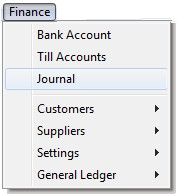
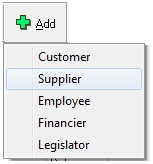

:::warning MM?
This document seems to be an updated version of the already converted and processed **Supplier Journal** above?? 
:::

## Procedure Guideline
___ 

1.  Click on Finance on the Main Menu.  

2.  Then click the Journal item on the
    Sub-Menu.  
	
  

3.  The system will open a screen titled "Maintain Journal." This screen
    lists all of the Journals that have already been captured in the
    system within the From and To Date specified in the Search Panel.
    Note that you can change the information displayed in this list by
    changing the dates and other information in the Search Criteria
    Panel above the list of orders.

  

4.  To Add a new Supplier Journal, click the Add button on the Form Bar
    and

5.  Then select Supplier from the list of items on the Sub-Menu.  
	
  	

6.  The system will open a screen titled "Add New Supplier Journal."
    This screen enables you to select a specific Supplier, enter a Date,
    an Amount and a Description for the Journal and then to allocate the
	Journal Amount to one of more Accounts in the General Ledger.

  

7.  You will first need to select the name of the Supplier for whom you
    wish to capture this journal. Simply either type in the Account Code
    for the Supplier in the Supplier Code field or select the Supplier
    from a list of Supplier Names by clicking on the three-dot button in
    the Supplier Code field.  

8.  Enter a Reference for the Journal in the Reference field. This could
    be, for example, Rent -- May 2013.  

9.  Assign the Journal a Transaction Number. Ideally you should keep
    these sequential but you can also enter the Supplier's Document or
    Invoice Number in this field.  

10. Enter the date on which this Transaction became Effective. This is
    not the Capture Date but rather the Transaction Date. So, if Rent is
    due on the 1^st^ of the Month, then select 2013-05-01 from the drop
    down calendar.  

11. Enter the Amount of the Transaction in the Transaction Amount field.  

12. If you wish to add a Note to the Journal you can type this in the
    Note field.  

  

13. Once you have completed the header portion for the journal, click
    the yellow + button at the top of the form to add Accounts from the
    General Ledger to which you can allocate the amount of the journal.  

14. Click the three-dot button in the right hand side of the Account
    Code field in the grid.  

15. The system will open the Select Chart of Accounts screen. Enter the
    name of the Account to which you wish to allocate the Journal. For
    example, Rent.  

16. Then click the Search button.  

17. Then make sure the account you are about to select is correct by
    confirming it appears on the right statement and is either an Income
    or Expense account.  

18. Then click the Select button.  

19. Then you need to select the applicable Tax or VAT for this
    Transaction. Most often it Is code 4 -- Standard Rate -- Goods and
    Services.  
	
  	

20. Once you have selected the appropriate VAT code click the select
    button.  

21. Click the Select Button on the form bar.  

22. The system will display the VAT code you have selected in the
    Journal.  

  

23. Then enter the total VAT Inclusive Amount in the Bank Inclusive
    column.  

24. The system will calculate both the VAT and the VAT Exclusive Amounts
    and display these in the appropriate columns in the Journal.  

25. Click the Save button.  

26. The system will return you to the Maintain Supplier Journal Screen
    and you will see the Journal you have entered in the list.  

27. You might now wish to go the Aged Accounts Payable list and check
    that the Journal you have entered for the supplier appears in the
    list of outstanding payments.  

**This is the end of this procedure.**
