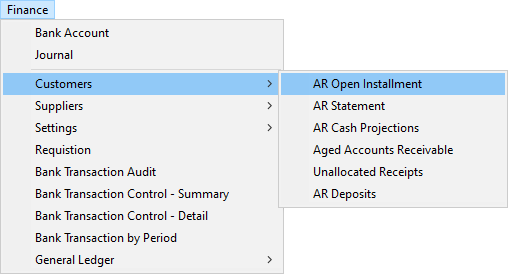
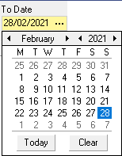

## Procedure Guideline
___  

Installments are either amounts due from customers as deposits against
Sales Orders or amounts due on invoices or statements sent to
suppliers.  
The **Open Installment** screen in Sense-i displays a list and
the details of each of these amounts.  

Note that all transactions that have been fully settled are excluded
from the list.  

1.  Click on **Finance** on the main menu.  

2.  Click **Customers** on the drop down menu.  

3.  Click **AR (_Accounts Receivable_) Open Installment** on the side menu.  

  

The system will display the **Accounts Payable Installments (Customers)** screen.  

  

This screen will enable you to view a list and the details of all customer
installments that remain unpaid.  
The system does not display any information until you have entered
**Search** options, e.g. a date in the **To Date** field.  

### Search Options  

1.  Click on the **To Date** field and then select a closing date for the
    report from the drop down **calendar**.  
	
  	

2.  Then click the **Search** button on the form bar.  

The system will display a list of all unpaid installments that were due
for payment before the **To Date** you entered above.  

  

3.  Click on the **Payment Due Date** column to have the system sort all the
    installments in the screen in date order.  

1.  If you change the **To Date** in the search frame at the top of the
    screen to an earlier date and then click the Search button again,
    you will notice that any installments that were on the screen and
    were due for payment _**after**_ the **To Date** you have now entered, will no
    longer appear on the screen.  

:::tip
Setting the **To Date** enables you to immediately view a list of all
payments outstanding and due to a specific date. Remember that all
transactions that have been fully settled are excluded from the list.
:::

5.  You can filter the list of installments in the screen to show only
    those installments that are outstanding for a specific customer. To
    do this, enter the customer's account code in the **Customer Code**
    field in the search panel. You can also click on the **three-dot button** 
	in the **Customer Code** field and search for a specific supplier
    by name using the pop-up **Select Customer** window.  
	
  

1.  Clicking the **Show All** option will cause the system to list all
    transactions for the selected customer that occur within the 
	**From Date** and the **To Date** selected in the search panel.  
	
	The **"Show All"** option will also display the details of each 
	installment, including the **Cancelled Value** of each transaction 
	as a separate row.  
	
	When **Show All** remains unchecked, then the system 
	combines the value of the original installment with the value of any 
	cancelled transactions and displays only the net amount outstanding 
	for each transaction on a single row.  
	
	You will notice a **"+"** sign appears next to the
    **Transaction Type** on each row where more detail exists for a specific
    transaction.  

1.  Clicking the **Show Applied** option will cause the system to list the
    details of any payments that have been allocated to each of
    partially paid installments.  

### Information Displayed

**Understanding the Information in the Screen**

The system displays a comprehensive list of information about each of
the outstanding installments in the various columns on the screen.  

  

1.  The customer's account code is displayed in the **Code** column.  

1.  The name of the customer is displayed in the **Customer Name** column.  

1.  The transaction type that caused the installment is displayed in the
    **Transaction Type** column.  

The installment can be caused by a deposit that needs be paid when
issuing a Sales Order, then the **Transaction Type** will be **SO** or\...  

The installment can be caused by an invoice sent to a customer,
then the **Transaction Type** will be **SO Invoice**.  

4.  The system displays the transaction number in the **Transaction No**
    column. This allows you to find the Sales Order or Sales Order
    Invoice that has caused the installment to be created.  

1.  The system displays the date of the transaction in the 
	**Transaction Date** column. This is not the date on which the payment 
	is due but rather the date on which either the Sales Order or the 
	Sales Order Invoice was created.  

1.  Any additional reference number, such as an internal order number or
    job number that was captured on the Sales Order or Sales Order
    Invoice is displayed in the **Reference** column.  

1.  The system displays the Term Detail Name in the **Payment Terms**
    column. This is the rule in the payment terms that created the
    installment displayed in the list.  

  

8.  The system displays the date on which the installment is due to be
    paid in the **Payment Due Date** column.  

1.  The system displays the amount still to be paid, that is the
    Original Installment Amount -- Payments Made To Date, in the
    **Outstanding Amount** column.  

1.  If any discount is available to be taken for early payment, the
    system displays the date by which payment must be made to qualify
    for the discount in the **Discount Date** column.  

1.  The system calculates the discount available as a percentage of the
    total installment and displays this in the **Eligible Discount %**
    column.  
	
:::note 
The Eligible Discount is based on what discount can taken if the payment 
is made **prior** to the **Discount Date**.  
The Eligible Discount % changes to 0 if a payment is late.  
:::

12. The system displays the value of the discount available in the
    **Eligible Discount** column.  

1.  The system displays the number of days to go before the payment is
    due. If the payment is late, this figure will be a negative value.  

  

14. The system displays the original amount of the installment in the
    **Original Amount** column.  

15. The system displays the original discount amount in the 
	**Original Discount** column.  

16. The system displays the total value of the payments made and
    allocated to the installment in the **Allocated To Date** column.  

17. The system displays the total value of the discounts taken against
    the installment in the **Discount To Date** column.  

You can use the normal techniques for displaying the information in
the screen in a way that suits your purpose to sort and filter
installment details.  

**This is the end of this procedure.**
