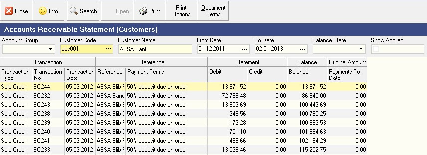
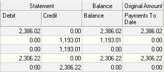
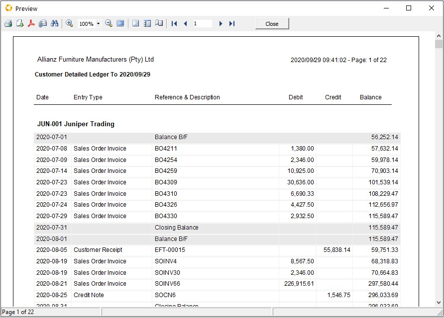

___ 
## Purpose

The purpose of this procedure is to describe the steps you need to
take to generate a report of that lists all transactions that have
occurred between the Company and its Customers for one or more
periods.  

This document is called a Customer Ledger and is generated for either
a specific customer or for all the customers for a given set of
periods.  

The report lists all the transactions between the company and the
customers in the selected periods and shows what transactions have
been captured.

## When to use

You would use this procedure either during the course of a month if
you were querying the status of a customer's account and then at the
end of the month you would generate statements for all customers to
advise them what payments they will need to make during the coming
period.  

To generate a Customer Ledger perform the following steps...  

1.  Click on **Finance** on the main menu.  

2.  Click **Customers** on the drop down menu.  

3.  Select **AR Statement (for Accounts Receivable)** on the side menu.  

  

The system will open a screen titled "Accounts Receivable Statement."
This provides you with a set of criteria that you can use to filter
the information that will be used to generate Customer Statements.

  

You will notice that as you enter the screen there is no information
displayed. This prevents the system from running unnecessary queries
and instead you need to enter some information in the search panel at
the top of the screen before the system will display any information
in the report.  

## Search Options

4.  You can filter the list of transactions in the Accounts Receivable
    Statement screen to show only those transactions that belong to a
    specific CUSTOMER GROUP. To do this select one Customer Group from
    the drop down list of **Account Groups**.  

5.  You can also choose to view only those transactions that occur for a
    specific customer. To do this, enter the customer's account code in
    the **Customer Code** field in the search panel. You can also click on
    the three-dot button in the Customer Code field and search for a
    specific customer by name using the pop-up Select Customer window.  

6.  You can choose to view only those transactions that occur
	**FROM a specific date.**  
	To do so select the starting date from the drop down
    calendar that is displayed in the **From Date** field.  

7.  You can choose to exclude transactions that occur
	**AFTER a specific date**.  
	To do so select the ending date from the drop down calendar
    that is displayed in the **To date** field.  

8.  When you have entered specific information in the Search Panel,
    click the **Search button** on the form bar. Note that you can also
    choose to click the Search button without entering any information
    in the Search Panel and the system will then display all the
    information related to Customer transactions on the screen.  

## Understanding the Information displayed

The system displays a comprehensive list of information about the
various transactions captured against each customer's account in the
columns on the screen.  

  

9.  The customer's account code is displayed in the Code column.  

10. The name of the customer is displayed in the Customer Name column.  

11. The transaction type is displayed in the Transaction Type column.  

The instalment can be caused by a deposit that needs be paid when
placing a Purchase Order, then the Transaction Type will be SO or\...  

The instalment can be caused by an invoice received from a customer,
then the Transaction Type will be SO Invoice.  

A payment received from a customer is assigned a Transaction Type of
Receipt.  

12. The system displays the transaction number in the Transaction No
    column. This allows you to easily find any transaction that has been
    captured against that customer's account.  

13. The system displays the date of the transaction in the Transaction
    Date column.  

14. Any additional reference number, such as an internal order number or
    job number that was captured on the Sales Order or Sales Order
    Invoice is displayed in the Reference Number column.  

15. The system displays the Term Detail Name in the Payment Terms
    column. This is the rule in the payment terms that created the
    instalment displayed in the list.  

  

16. The system displays any transaction that increased the customer's
    account balance in the Debit column.  

17. The system displays any transaction that decreased the customer's
    account balance in the Credit column.  

18. The system displays the running balance after each debit or credit
    transaction in the Balance column.  

19. The system display information about any payments made to date
    against a specific instalment in the Payments to Date column.  

20. To print a statement for the customer, click the Print button on the
    form bar and  

21. then click the Customer Ledger menu item.  

  

22. The system displays the report in a Print Preview window.  

  

You can choose to either print, fax or email the ledger.

23. To simply Print the Customer Ledger, click the Printer Icon.  

24. To close this screen, click the close button at the top of the
    screen.  

**This is the end of this procedure.**
