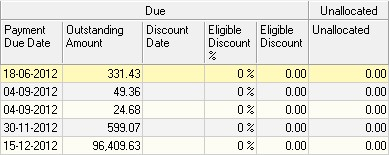
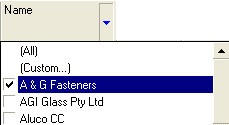

## Procedure Guideline
___  

The Aged Accounts Receivable Report provides you with information
about installments that are outstanding from the company's Customers,
(in other words money owed to the company that has not yet been paid).
The report groups the outstanding installments into aging periods that
indicate for how long each instalment has been owed by each customer.

:::note
All transactions that have been fully settled are excluded from the list.  
:::

1.  Click on **Finance** on the main menu.  

2.  Click **Customers** on the drop down menu.  

3.  Select **Aged Accounts Receivable** on the side menu.  

  

The system will display the Aged Accounts Receivable screen. This
screen lists all outstanding instalments due to be paid to the
company's customers and ages each amount into one of several aging
columns, depending on how long the amount has been outstanding.  

  

4.  You will notice that as you enter the screen, the system defaults
the date to the end of the current month.  

### Using the Search Options in the Search Panel  

5.  You can filter the list of installments in the screen to show only
those installments that are outstanding for a specific customer. To
do this, enter the customer's account code in the Customer Code
field in the search panel. You can also click on the three-dot
button in the Customer Code field and search for a specific
customer by name using the pop-up Select Customer window.  

6.  When you have entered specific information in the Search Panel,
click the Search button on the form bar.

### Understanding the Information in the Screen 

The system displays a comprehensive list of information about each of
the outstanding installments in the various columns on the screen.

  

7.  The customer's account code is displayed in the Code column.  

8.  The name of the customer is displayed in the Customer Name column.  

9.  The transaction type that caused the installment is displayed in the
Transaction Type column.  
The installment can be caused by a deposit that needs be paid when
placing a Sales Order, then the Transaction Type will be SO or\...  

The instalment can be caused by an invoice generated for a delivery
made to a customer, then the Transaction Type will be SO Invoice.  

10. The system displays the transaction number in the Transaction No
column. This allows you to find the Sales Order or Sales Order
Invoice that has caused the instalment to be created.  

11. The system displays the date of the transaction in the Transaction
Date column. This is not the date on which the payment is due but
rather the date on which either the Sales Order or the Sales Order
Invoice was created.

12. Any additional reference number, such as an internal order number or
job number that was captured on the Sales Order or Sales Order
Invoice is displayed in the Reference Number column.  

13. The system displays the Term Detail Name in the Payment Terms
column. This is the rule in the payment terms that created the
instalment displayed in the list.  

  

14. The system displays the date on which the instalment is due to be
paid in the Payment Due Date column.  

15. The system displays the amount still to be paid in the Outstanding
Amount column.
_(The Outstanding Amount is calculated from the Original Instalment Amount -- Payments Made To Date.)_  

16. If any discount is available to be taken for early payment, the
system displays the date by which payment must be made to qualify
for the discount in the Discount Date column.  

17. The system calculates the discount available as a percentage of the
total instalment and displays this in the Eligible Discount %
column. Note that the Eligible Discount is based on what discount
can taken if the payment is made prior to the Discount Date. The
Eligible Discount % changes to 0 if a payment is late.  

18. The system displays the value of the discount available in the
Eligible Discount column.  

19. The system displays the number of days to go before the payment is
due. If the payment is late, this figure will be a negative value.  

  

The system displays information about how long installments have been
outstanding using a familiar Aging format. The number of days each
instalment has been outstanding is calculated and then used to display
each instalment in one of the columns showing how long the money has
been owing by the customer.  

20. The system displays the amount that has already been paid by a
customer but that has not been allocated to any installments in the
Unallocated column. This allows you to more accurately see the
total owing by each customer and to identify customers where
payments have been made that still need to be allocated to
specific installments.  

21. The system displays the total amount still outstanding in each of
the 6 aging columns.  

22. The system displays the total value of any installments that are due
after the As At Date used in the search panel in the Future Due
column.  

### Sorting and Analyzing Information in the screen.

There are several quick and effective ways to sort and analyse the
information in the screen. The first is to click on the right hand
side of any column heading. The system will displays a small black
arrow.  

If you click on this arrow the system will display a list of all
unique information that appears in the column. If any information
appears more than once then the system will only show that information
once in the list.  

By clicking on one or more of the records in the list, the system will
filter the remaining information in the list to show the information
related to only the records you have selected.  

**Click on the records in the drop down list for which you wish to information.**  

  

An arrow is available on the right hand side of each column heading.  

Note that any records not selected are hidden from view but are still
present on the screen and can be easily accessed by either clicking
the item in the list or clicking the (All) option at the top of the
list.  

You can also right click the mouse in the grid and select Grid Layout
and then Enable Groups from the menu that is displayed on the screen.  

  

You will notice that once you have selected enable groups, the system
will display a dark grey bar at the top of the report. You can then
click on any column heading and drag it up into the grey bar.  

  

**Drag a column heading up into the Enable Groups bar.**  

The system will then group all the information in the report by the
column heading you have moved in the grey grouping bar. You will
notice that sub-totals are displayed on the header rows by which the
information has been grouped.

  

Grouping information in the report enables you to quickly and easily
see sub-totals and summary information by customer.  

For the Aged Accounts Receivable Report it makes sense to group the
information in one of the following ways:  

-   By Customer to answer the question "How much does each customer owe
    the company in each of the aging periods?"

-   By Payment Due Date to answer the question "Which installments must
    customers pay and on which date?"

-   By Days Late (To Go) to answer the question "Which invoices must
    customers pay in each of the days late or to go groups?"

  

### Understanding the Unallocated Payments in the report  

You will notice that if a payment has been made to a customer and the
payment has not been allocated to specific invoices, the system will
display the payments that remain unallocated in the Unallocated column
and on a separate Payments row.  

  

Whenever any amounts are displayed in the Unallocated column it is an
indication that payments that have been made by customers still need
to be allocated to the specific invoices that they are paying. You
would usually request a remittance advice from a customer and then use
this information in the procedure that describes how to allocate
Customer Receipts to the Installments they are paying.  

Once the payments have been allocated to specific invoices, the row
containing the payment and any invoices paid in full will no longer
appear on the report.

**This is the end of this procedure.**
