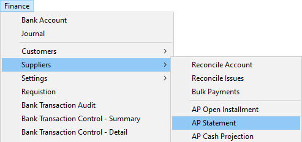

___ 
## Purpose

The purpose of this procedure is to describe the steps you need to
take to generate a report of that lists all transactions that have
occurred between the Company and its Suppliers for one or more
periods.  

This document is called a Supplier Ledger and is generated for either
a specific Supplier or for all the Suppliers for a given set of
periods.  

The report lists all the transactions between the company and the
Suppliers in the selected periods and shows what transactions have
been captured.

## When to use

You would use this procedure either during the course of a month if
you were querying the status of a Supplier's account and then at the
end of the month you would generate statements for all Suppliers to
access what payments will need to be made during the coming
period.  

To generate a Supplier Ledger perform the following steps...  

1.  Click on Finance on the main menu.  

2.  Click Suppliers on the drop down menu.  

3.  Click AP Statement (for Accounts Payable) on the side menu.  

  

The system will open a screen titled "Accounts Payable Statement."
This provides you with a set of criteria that you can use to filter
the information that will be used to generate Supplier Statements.

You will notice that as you enter the screen there is no information
displayed. This prevents the system from running unnecessary queries
and instead you need to enter some information in the search panel at
the top of the screen before the system will display any information
in the report.  

## Search Options

4.  You can filter the list of transactions in the Accounts Payable
    Statement screen to show only those transactions that belong to a
    specific Supplier GROUP. To do this select one Supplier Group from
    the drop down list of Account Groups.  

5.  You can also choose to view only those transactions that occur for a
    specific Supplier. To do this, enter the Supplier's account code in
    the Supplier Code field in the search panel. You can also click on
    the three-dot button in the Supplier Code field and search for a
    specific Supplier by name using the pop-up Select Supplier window.  

6.  You can choose to view only those transactions that occur AFTER a
    specific date. To do so select the starting date from the drop down
    calendar that is displayed in the From Date field.  

7.  You can choose to exclude transactions that occur AFTER a specific
    date. To do so select the ending date from the drop down calendar
    that is displayed in the To date field.  

8.  When you have entered specific information in the Search Panel,
    click the Search button on the form bar. Note that you can also
    choose to click the Search button without entering any information
    in the Search Panel and the system will then display all the
    information related to Supplier transactions on the screen.  

## Understanding the Information displayed

The system displays a comprehensive list of information about the
various transactions captured against each Supplier's account in the
columns on the screen.  

9.  The Supplier's account code is displayed in the Code column.  

10. The name of the Supplier is displayed in the Supplier Name column.  

11. The transaction type is displayed in the Transaction Type column.  

The instalment can be caused by a deposit that needs be paid when
placing a Purchase Order, then the Transaction Type will be PO or\...  

The instalment can be caused by an invoice received from a Supplier,
then the Transaction Type will be PO Invoice.  

A payment made to a Supplier is assigned a Transaction Type of
Receipt.  

12. The system displays the transaction number in the Transaction No
    column. This allows you to easily find any transaction that has been
    captured against that Supplier's account.  

13. The system displays the date of the transaction in the Transaction
    Date column.  

14. Any additional reference number, such as an internal order number or
    job number that was captured on the Purchase Order or Purchase Order
    Invoice is displayed in the Reference Number column.  

15. The system displays the Term Detail Name in the Payment Terms
    column. This is the rule in the payment terms that created the
    instalment displayed in the list.  

16. The system displays any transaction that increased the Supplier's
    account balance in the Debit column.  

17. The system displays any transaction that decreased the Supplier's
    account balance in the Credit column.  

18. The system displays the running balance after each debit or credit
    transaction in the Balance column.  

19. The system display information about any payments made to date
    against a specific instalment in the Payments to Date column.  

20. To print a statement for the Supplier, click the Print button on the
    form bar and  

21. then click the Supplier Ledger menu item.  

22. The system displays the report in a Print Preview window.  

You can choose to either print, fax or email the ledger.

23. To simply Print the Supplier Ledger, click the Printer Icon.  

24. To close this screen, click the close button at the top of the
    screen.  

**This is the end of this procedure.**
