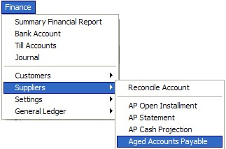
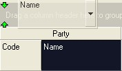
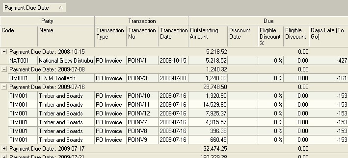

## Introduction
___  

The Aged Accounts Payable Report provides you with information about
installments that are outstanding to suppliers, (in other words not yet
paid).  
The report groups the outstanding installments into aging periods
that indicate for how long each installment has been owed to each
supplier.  

:::note
All transactions that have been fully settled are excluded
from the list.
:::

1.  Click on Finance on the main menu.  

2.  Click Suppliers on the drop down menu.  

3.  Click AP (for Accounts Payable) Open Instalment on the side menu.  

The system will display the Aged Accounts Payable screen. This screen
lists all outstanding instalments due to be paid to the company's
suppliers and ages each amount into one of several aging columns,
depending on how long the amount has been owing to the supplier.

  

4.  You will notice that as you enter the screen, the system defaults
    the date to the end of the current month.

## Search Options

5.  You can filter the list of instalments in the screen to show only
    those instalments that are outstanding for a specific supplier. To
    do this, enter the supplier's account code in the Supplier Code
    field in the search panel. You can also click on the three-dot
    button in the Supplier Code field and search for a specific supplier
    by name using the pop-up Select Supplier window.

6.  When you have entered specific information in the Search Panel,
    click the Search button on the form bar.

## Understanding the Information displayed

The system displays a comprehensive list of information about each of
the outstanding instalments in the various columns on the screen.  

  

7.  The supplier's account code is displayed in the Code column.

8.  The name of the supplier is displayed in the Supplier Name column.

9.  The transaction type that caused the instalment is displayed in the
Transaction Type column.

The instalment can be caused by a deposit that needs be paid when
placing a Purchase Order, then the Transaction Type will be PO or\...

The instalment can be caused by an invoice received from a supplier,
then the Transaction Type will be PO Invoice.

10. The system displays the transaction number in the Transaction No
column. This allows you to find the Purchase Order or Purchase
Order Invoice that has caused the instalment to be created.

11. The system displays the date of the transaction in the Transaction
Date column. This is not the date on which the payment is due but
rather the date on which either the Purchase Order or the Purchase
Order Invoice was created.

12. Any additional reference number, such as an internal order number or
job number that was captured on the Purchase Order or Purchase
Order Invoice is displayed in the Reference Number column.

13. The system displays the Term Detail Name in the Payment Terms
column. This is the rule in the payment terms that created the
instalment displayed in the list.

14. The system displays the date on which the instalment is due to be
paid in the Payment Due Date column.

15. The system displays the amount still to be paid, that is the
Original Instalment Amount -- Payments Made To Date, in the
Outstanding Amount column.

16. If any discount is available to be taken for early payment, the
system displays the date by which payment must be made to qualify
for the discount in the Discount Date column.

17. The system calculates the discount available as a percentage of the
total instalment and displays this in the Eligible Discount %
column. Note that the Eligible Discount is based on what discount
can taken if the payment is made prior to the Discount Date. The
Eligible Discount % changes to 0 if a payment is late.

18. The system displays the value of the discount available in the
Eligible Discount column.

19. The system displays the number of days to go before the payment is
due. If the payment is late, this figure will be a negative value.

  

The system displays information about how long instalments have been
outstanding using a familiar Aging format. The number of days each
instalment has been outstanding is calculated and then used to
allocate each instalment to one of the columns showing how long the
money has been owing to the supplier.

20. The system displays the amount paid to a supplier that remains
unallocated in the Unallocated column. This allows you to more
accurately see the total owing to each supplier and to identify
suppliers where payments have been made that still need to be
allocated to specific instalments.

21. The system displays the total amount still outstanding in each of
the 6 aging columns.

22. The system displays the total value of any instalments that are due
after the As At Date used in the search panel in the Future Due
column.

## Sorting and Analyzing Information

There are several quick and effective ways to sort and analyse the
information in the screen. The first is to click on the right hand side
of any column heading. The system will displays a small arrow and if you
click on this arrow the system will display a list of all unique
information that appears in the column. If any information appears more
than once then the system will only show that information once in the
list. By clicking on one or more of the records in the list, the system
will filter the remaining information in the list to show the
information related to only the records you have selected.

Click on the records in the drop down list for which you wish to information.

  
An arrow is available on the right hand side of each column heading.

Note that any records not selected are hidden from view but are still
present on the screen and can be easily accessed by either clicking the
item in the list or clicking the (All) option at the top of the list.

You can also right click the mouse in the grid and select Grid Layout
and then Enable Groups from the menu that is displayed on the screen.

  

You will notice that once you have selected enable groups, the system
will display a dark grey bar at the top of the report. You can then
click on any column heading and drag it up into the grey bar.  

  

Drag a column heading up into the Enable Groups bar.  

The system will then group all the information in the report by the
column heading you have moved in the grey grouping bar. You will notice
that sub-totals are displayed on the header rows by which the
information has been grouped.  

Grouping information in the report enables you to quickly and easily see
sub-totals and summary information by supplier.

For the Aged Accounts Payable Report it makes sense to group the
information in one of the following ways:

-   By Supplier to answer the question "How much do we owe each supplier
    in each of the aging periods?"

-   By Payment Due Date to answer the question "Which invoices must we
    pay on which date?"

-   By Days Late (To Go) to answer the question "Which invoices must we
    pay in each of the days late or to go groups?"

  

## Unallocated Payments

You will notice that if a payment has been made to a supplier and the
payment has not been allocated to specific invoices, the system will
display the payments that remain unallocated in the Unallocated column
and on a separate Payments row.

  

Once the payments have been allocated to specific invoices, the row
containing the payment and any invoices paid in full will no longer
appear on the report.  

**This is the end of this procedure.**
