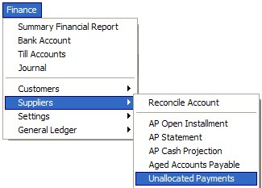
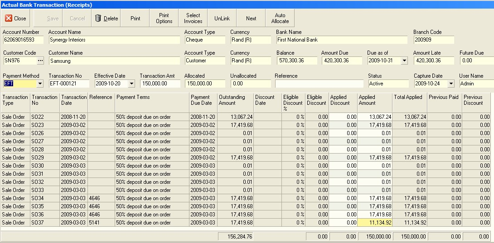
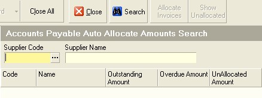

## Step-by-step Guideline
___ 

This procedure describes how you can record details of payments that
have been made to suppliers in the Sense-I System so that the reports
displaying outstanding supplier balances and cash flow reports are
accurate.  

1.  Click on the Finance item on the Main Menu.  

2.  Click on the Suppliers item on the Drop Down Menu.  

3.  Click on the Unallocated Payments item on the Side Menu.  

  

The system will display the Unallocated Accounts Payable screen. This
screen lists all of the payments that have been made against supplier
accounts but that have not yet been allocated to outstanding
instalments.  

  

To process unallocated payments you will need to work through each of
the items in this list by opening the unallocated payment, selecting
the invoices to which to apply the payment and then either
automatically or manually allocating the payment amount to each
outstanding instalment.  

4.  Click on the first unallocated payment you wish to process.  

5.  Click on the Allocate To Invoices button.  

The system will return you to the Auto Allocate Payments screen.  

The system will display the name of the selected supplier in the
Supplier Name field and the total unallocated amount that is available
to be allocated to open instalments in the Available Amount field.  

  

6.  To allocate the available amount click the Select Invoices button on
    the form bar.  

The system will open Accounts Payable Installment Screen. This screen
lists all of the invoices that have been received from the selected
supplier that are either completely or partially unpaid. 

:::note Reference
For more information on how to use Open Installment please read the
procedure titled **["Open Installments"](4050)**.
:::

  

7.  Click on the instalment to which you wish allocate the saved payment
    in the grid. To select more than one instalment, hold down the
    Control key on the key board and then click on the invoices you wish
    to select. You can also select many instalments that are displayed
    one below the other by clicking on the first instalment, then
    holding down the shift key and then clicking on the last invoice.
    The system will mark the rows for all the instalments you have
    selected in yellow.  

8.  Once you have selected the instalments to which you wish to allocate
    the payment, click on the Select button.  

The system will return you to the Auto Allocate Payments screen and
display the instalments you have selected in the grid.  

  

9.  You can apply specific amounts from the overall payment to each
    invoice by typing the amount you wish to apply to each invoice in
    the Applied Amount field. To move the cursor to the next invoice,
    simply press the down arrow on the keyboard and the system will
    select the next invoice in the list.  

10. You can also enter the amount of discount you wish to apply to each
    invoice by typing this amount in the Applied Discount field.  

11. The system can automatically apply the amount of the payment you
    have saved to each invoice from the oldest invoice to the most
    recent. To do this, simply click the AutoAllocate button on the form
    bar. Note that if the terms for the supplier have been set-up
    correctly the system will calculate the discount on each invoice and
    take this into consideration when applying the payment.  

12. To remove an invoice from the list click the UnLink button on the
    form bar.  

13. You will notice that if you select more transactions / instalments
    to which to allocate the payments being processed and then select
    Auto Allocate and Save the system will only link the instalments to
    which a portion of the payment has been linked. Any transactions
    that have not had any funds allocated will be removed from the
    screen when you return to the screen and view or edit the detail of
    the transaction.  

  

14. On re-opening this screen for a specific payment the system only
    show the instalments that have payments allocated linking them fully
    or partially.  

  

15. In effect this allows you to process payments to suppliers and
    receipts from customers more quickly because you do not need to
    select the invoices being paid one by one. You can simply assume
    that transactions being paid are being paid in order from oldest due
    to most recent due and if you select transactions for more than the
    total being processed and choose auto allocate, the system will
    discard any transactions you have selected that are due after the
    final transaction to which payment has been allocated.  

16. Once you have completed allocating the payment to the selected
    invoices click the Save button.  

17. Click the Close button on the form bar once you have allocated the
    available amount to open instalments.  

The system will return you to the Auto Allocate Payments screen.  

  
18. Click the Search button and if you have allocated the full available
    amount, the supplier's name will be removed from the list.  
	
Repeat the above steps until all payments have been allocated.  

**This is the end of the procedure.**
