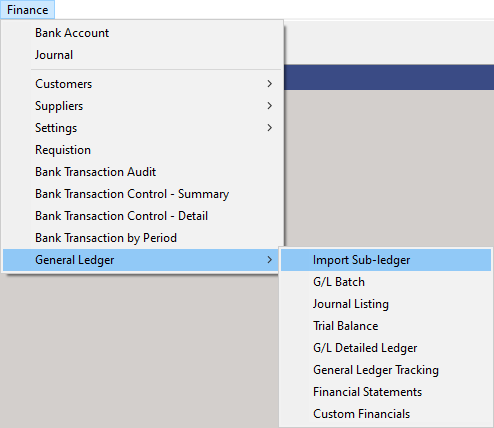
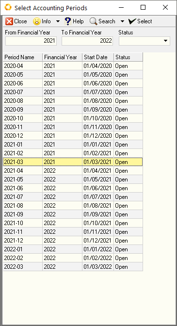
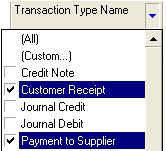

## Step-by-step Guideline  
___ 

1.  Click on the **Finance** option on the Main Menu.

2.  Then click the **General Ledger** item on the drop down menu.

3.  Then click **Import Sub-ledger**

  

The system will open a screen titled "**Maintain Sub-ledger Imports**."  
Initially, this screen displays no information. You need to select a
specific Accounting Period before any information about which
transactions are available to be imported.

  

4.  To select an Accounting Period, click the **Down Arrow** in the
    **Accounting Period** field.

  

The system will open a **Select Accounting Periods** window.

5.  Click on the Accounting Period for which you wish to import
    transactions into the General Ledger. This would normally be the
    month you are working in, which should either be the Current or the
    Previous Month.

6.  Then click the **Select** button.

The system will close the Select Accounting Periods window and display
the **year** and **month** of the Accounting Period you have chosen in the
**Accounting Period** field.

You will also notice that the Search button will become enabled on the
Maintain Sub-ledger Imports screen.

7.  Click the **Search** button.

The system will take a few seconds to check the entire database for
all transactions that impact the General Ledger Account Balances that
have not yet been imported into the General Ledger.

The system then sums the values of the transactions not yet imported
for the selected Accounting Period and displays one row for each
different transaction type.

## Understanding the Maintain Sub-Ledger Imports Screen  

  

The Maintain Sub-Ledger Imports screen displays the following
information about the transactions not yet imported into the General
Ledger.

**A**.  The system displays the **Accounting Period** in the format of
	**Year - Accounting Period No** _(**YYYY-##**)_ in the Accounting Period column.

**B**.  The system displays the **Start Date** and **End Date** for the
    corresponding Accounting Period in the **Period Dates** column.

**C**.  The system displays the Status for the Accounting Period in the
    **Period Status** column.  

**D**.  The Total Financial Value of all the Transactions in the batch
    (Inclusive of Tax Amount where Tax is applicable) is displayed in
    the **Batch Total** column.  
	You can use this to compare the Total Value
    that will be created in the General Ledger Batch for the Accounting
    Period to a list of the Transaction on which the Batch has been
    created. In our example above, you could print a list of all the
    Purchase Order Invoices captured in the system for the selected
    period and compare the total on the printed list to the total on the
    Maintain Sub-Ledger Import screen.

**E**.  The system displays the number of transactions that are included in
    the Batch in the **No of Journals** column.

**F**.  The system finds the Transaction Number or Document Number for the
    **FIRST transaction** in the Batch and displays this in the **From Ref No**
    column.

**G**.  The system finds the Transaction Number or Document Number for the
    **LAST transaction** in the Batch and displays this in the **To Ref No**
    column.

**H**.  The system displays the effective or transaction date of the
	**FIRST and LAST transactions** in each batch in the **From Date** and **To Date**
    columns.

**I**.  The system displays the **Transaction Type Code** that relates to the
    transactions included in the batch in the Transaction Type Code.
    This helps you to quickly identify and select any specific group of
    Transactions you wish to import.

You might for example decide that you want to import and review all
invoices from suppliers. You would then select the POINV or Purchase
Order Invoice transaction row.

**J**.  The name of each Transaction Type is displayed in the
	**Transaction Type Name** field.  

**K**.	The Role column depicts the Journal Type **Role**, be it Supplier, Customer or other relevant party.

## Using The Quick Filter

You can choose any of the columns to analyse, filter, group and select the
transaction types with which you wish to work. Use the **Quick Search**
features that are built into the **Column Headings** on every list screen
to quickly select the rows you need.

8.  If you click on the right hand side of most column headings on a
    list screen you will notice the system displays a down-arrow
    button. If you click on this button the system will display all of the
    unique values in the list screen.

This is known as the Quick Filter List.

  

9.  You can select one or more of the items in the list screen by
    selecting in the checkbox to the left of each value.

The system will then hide all items in the underlying list screen that
do not correspond with the values you have selected in the Quick
Filter List.

If you, for example, only wanted to view the transactions for payments
received from Customers and made to Suppliers, you would check
Customer Receipt and Payment to Supplier.

The system would display only those rows that contained the values you
have selected.

10. All the information remains in the list but is simply hidden from
    view. To undo the Quick Filter selection, click the (All) option at
    the top of the list.

## Importing Batches Into The General Ledger

You can import one or more, or all of the batches in the list, into
the General Ledger.

  

11. Click on the row(s) that contain the transaction(s) which you wish to
    import into batches in the General Ledger

To select a group of adjacent transactions, click on the row
containing the first transaction type you wish to select, then hold
down the **Shift Key** on your keyboard and then click on the last
transaction you wish to select. The system will mark in yellow all the
transactions you have selected to import.

If you wish to select a set of non-adjacent transactions, hold down
the **Control Key** on your keyboard and then click on each row that you
wish to include. The system will mark the rows you have selected in
yellow and leave the rows in between that are not selected in white.

12. Once you have identified which transactions you wish to import into
    batches, click the **Import** button.

The system will create a new General Batch and insert one Journal for
each of the transactions to be imported into this batch. Once the
batch has been imported successfully the system will remove the row
from the Maintain Subledger Import screen. This is to prevent you from
mistakenly importing the same transaction twice.

:::note
At this stage you do not need to worry about any errors that
may occur from incorrect posting rules or other mistakes.  

The system does not allow you post any batches that contain a journal
that does not balance.  
:::

As long as a batch is not posted, the system allows you to delete any
journal from a batch if the journal does not balance. If you do this,
then that transaction will be included in the list of transactions to
be imported the next time you open the Maintain Sub-ledger Import
screen and search for un-imported transactions.

Finally, the system allows you to delete an entire batch as long as it
has not been posted. The transactions will also then appear the next
time you search for un-imported transactions.

13.	Once you have completed Importing the transactions you wish to
include in the General Ledger, click the **Close** button.

The system will Close the Maintain Sub-ledger Import screen and return
you to the main screen in the application.

**This is the end of the procedure.**
