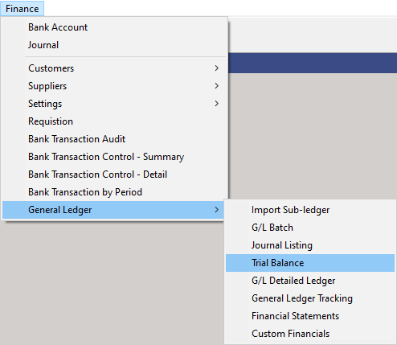
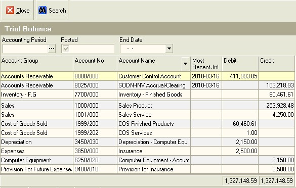

## Step-by-step Guideline  
___ 
1.  Click on the **Finance** option on the Main Menu.

2.  Then click the **General Ledger** menu item on the drop down menu.

3.  Then click **Trial Balance**.  

  

The system will open a screen titled "Trial Balance."  
This screen lists the BALANCE for each Account as at the end of the
Accounting Period you select in the Accounting Period field.

  

In order to view the Trial Balance for the company, you first need to
define the Accounting Period that the system will use for retrieving
the information needed to calculate the Balances displayed for each
Account..

4.  To select an Accounting Period, click the three dot button in the
    Accounting Period field.

The system will open a Select Accounting Periods window.

  

5.  Click on the Accounting Period you wish the system to use as the
    date for the Trial Balance.

6.  Then click the Select button.

The system will close the Select Accounting Periods window and display
the Accounting Period you have selected in the Accounting Period field
in the Search Panel on the Trial Balance screen.

7.  Then click the Search button.

The system will then retrieve the information from the General Ledger
required to calculate the closing balances for each Account in your
company's Chart of Accounts as at the end of the selected Accounting
Period.

You will notice that the system displays a Balance in either the Debit
or the Credit column for each Account in the list.

  

## Credit columns

Note that you can choose to include either only Posted Transactions,
Un-Posted Transactions or Both Posted and Un-posted Transactions in
the calculated closing balance for each account in the Trial Balance.

8.  To select which option to use, click on the option you wish to use
    from the list displayed in the Posted field. You should, when
    viewing the Trial Balance for the company always only select the
    Posted option. The use of Un-Posted is mostly selected when
    reviewing the status of the transactions in the General Ledger as
    part of the process of finalizing your company's financial
    statements.

  

9.  You can print the transactions listed in the Detailed Ledger by
    clicking the Print button.

The system will display the Trial Balance for the selected Accounting
Period in a Print Preview window. You can save and email this report
as a PDF or Print the Report directly from this screen.

  

10. To print the report, click the Printer Icon displayed at the top
    left of the screen and then select the appropriate print settings.

11. When you have completed printing the report, click the Close button.

12. When you have completed Reviewing Trial Balance for your company,
    click the Close button.

13. The system will close the Review Financial Statements screen.

**This is the end of the procedure.**