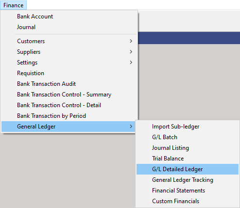
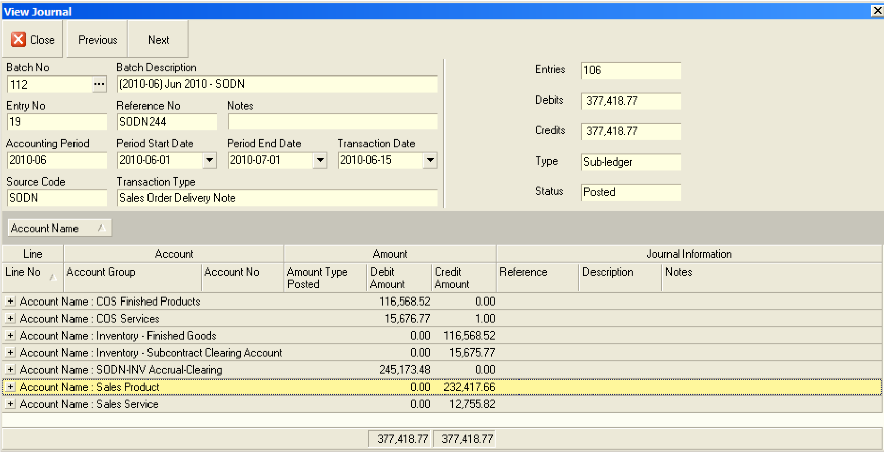
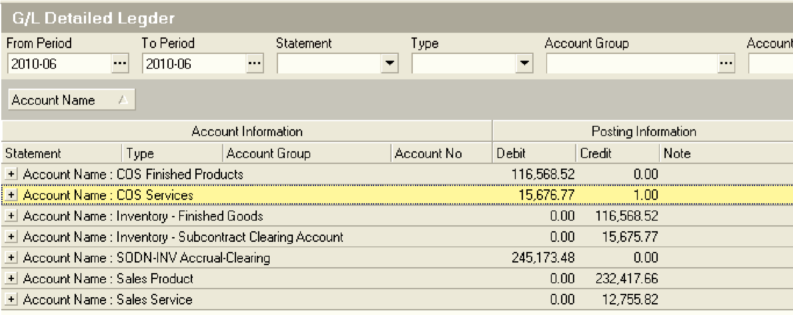
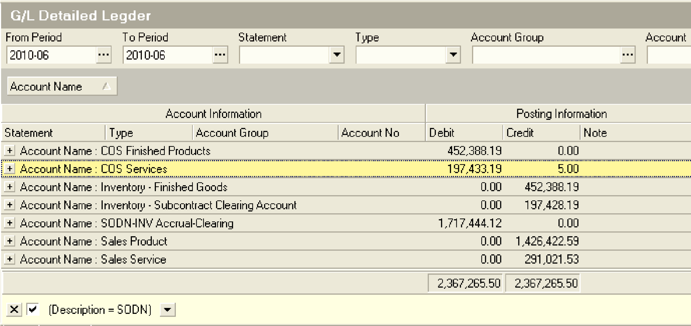
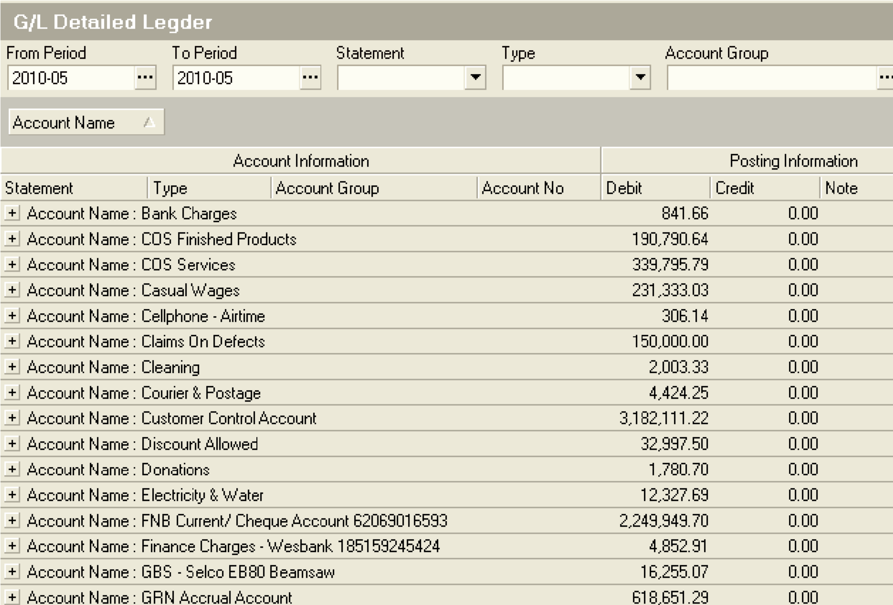
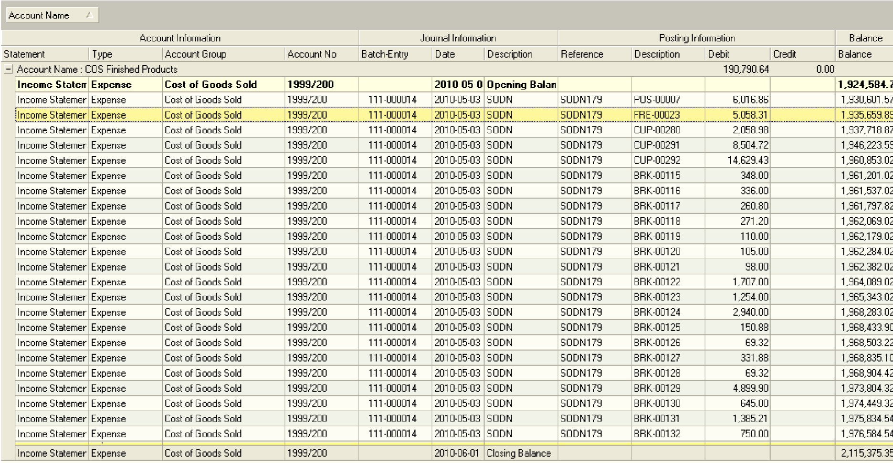

## Purpose  
Helps you understand and audit the balances of accounts in the General
Ledger by displaying the details of every transaction for each account
in your Chart of Accounts.
___ 
## Step-by-step Guideline  

1.  Click on the **Finance** option on the Main Menu.

2.  Then click the **General Ledger** menu item on the drop down menu.

3.  Then click **G/L Detailed Ledger**.  

  

The system will open a screen titled "G/L Detailed Ledger." The G/L
Detailed Ledger screen displays the detailed transaction information
and a running balance for each account that has been defined in the
Chart of Accounts and to which transactions have been imported.

  

## Understanding the G/L Detailed Ledger Screen

The worksheet for the G/L Detailed Ledger screen contains the
following columns to allow you to quickly and easily analyse the
information for each account in the General Ledger.  

  

### ACCOUNT INFORMATION BAND

The system displays information about each account in the Account
Information Band.

A.  The system displays the Financial Statement to which the account is
    linked and will be displayed in the Statement column.

B.  The system displays type of account as set in the Account Type field
    when creating the account in the Chart of Accounts. This would be
    either Asset, Liability, Owner's Equity.

C.  The system displays the Account Group to which the account is linked
    when it was created in the Chart of Accounts. This allows you to
    categorize, sum and analyse financial information at a higher level
    than that of an account.

D.  The system displays the Account Number assigned to the Account in
    the Chart of Accounts. This allows you to quickly find and track the
    transactions for a specific account.

E.  The system displays the Account Name assigned to the Account in the
    Chart of Accounts. This name is an indication of the types of
    transactions that were posted to the General Ledger. So, for
    example, if an account name is Electricity, you know that the
    financial values displayed in this account is for Electricity
    related expenditure.

### ACCOUNT PERIOD BAND

F.  The system displays the YEAR and MONTH of the Accounting Period to
    which each transaction has been posted.  
___ 
  

### JOURNAL INFORMATION BAND

G.  The system displays the Batch Entry number for each row in the
    General Ledger Detailed Ledger screen. The Batch Entry number is
    generated by the system through combining the number of the GL Batch
    in which the transaction was created with the Journal number of the
    transaction used in that batch. So the Batch Entry number 60000005
    means GL Batch number 60 and Journal number 5.

H.  The system displays the Date that the transaction was created in the
    Date column.

I.  The system displays a Code for the Transaction Type (also known as a
    Journal Type) that was used to create the original transaction in
    the Description field. This helps you to quickly identify in which
    function the transaction was created.

You might for example decide that you want to investigate a
transaction with the code POINV. This would tell you that you needed
to review a Purchase Order Invoice transaction. For a complete list of
all the Transaction Types and where to find them in the system, refer
to the document titled "**Transaction Type Guideline**."

### POSTING INFORMATION BAND

J.  The system displays the Transaction Number for the original
    transaction that created the entry in the Reference field. This will
    sometimes have a prefix that corresponds to the Transaction Type, so
    SODN244 refers to Sales Order Delivery Note 244 but sometimes, as in
    the case of Supplier Invoices or Bank Transactions it will simply
    have a number. To identify the original document in this case you
    must refer to both the Transaction Type code in the Description
    column together with the Reference number displayed in the Reference
    number column.

K.  The system displays a Description for the transaction in the
    Description column. If the leg of the journal that you are reviewing
    relates to a Customer or Supplier, then the system will display
    their name in the Description field. If the leg relates to a Product
    or Material, the system will display the item code in this column.
    If it relates to a Tax Item, then the system will display the Tax
    Item name in this field.

This enables you to quickly identify the entity to whom the
transaction was related without having to drill into the original
source transaction document.

L.  If the posting rule and underlying transaction for this leg of the
    journal posts to the selected account as a Debit, then the system
    will display the amount in the Debit column.

M.  If the posting rule and underlying transaction for this leg of the
    journal posts to the selected account as a Credit, then the system
    will display the amount in the Credit column.

N.  The system will display any note that has been entered against the
    journal in the Notes column.

O.  The system will add the amount from either the Debit or the Credit
    column to the balance of the account immediately before the row and
    display the balance after the transaction in the Balance column.

This allows you to monitor the running balance for the account after
each posted transaction.
___ 
## Using The Search Criteria 

  

The G/L Detailed Ledger contains several
fields that you can use to quickly search for and filter the
information displayed in the worksheet.

4.  When working with the information in the G/L Detailed Ledger it is a
    good idea to filter the information in the worksheet to one or more
    specific accounting periods.

Click on the three-dot button in the From Period field and select a
Starting Period.

5.  Click on the three-dot button in the To Period and select an Ending
    Period.

The system will then display only those transactions that occur in the
Starting Period, the Ending Period and any period in between.

6.  If you wish to limit the accounts that are displayed in the
    worksheet to either the Balance Sheet, Income Statement or Cash
    Statement, then select the appropriate Statement Type from the
    Statement field.

  

7.  If you wish to limit the accounts that are displayed in the
    worksheet to those of a specific Account Type, then select the
    Account Type you wish to use from the Type field.

  

8.  You can search for a specific Account Group using the lookup list
    displayed in the Account Group field and then limit the accounts
    displayed in the list to a specific Account Group.

9.  And finally, you can limit the transactions displayed in the
    worksheet to those that have been posted to a specific Account by
    selecting an account from the Chart of Accounts using the Account
    lookup field.  

  

10. Once you have set the search criteria you wish to use to filter the
    information displayed in the worksheet, click the Search button on
    the form bar.
___ 
## Using the Worksheet Quick Filter  

You can further filter the information in the worksheet by using any
of the columns to analyse, filter, group and select the information
with which you wish to work.

Use the Quick Search features that are built into the Column Headings
on every list screen to quickly select the rows you need.

If you click on the right hand side of most column headings on a list
screen you will notice the system displays a small black arrow head.
If you click on this button the system will display all of the unique
values in the list screen.

This is known as the Quick Filter List.

11.	In the Period Information band, click the Quick Filter arrow in
the Accounting Period column. Then click on the Accounting Period on
which you wish to focus.

  

You can apply the Quick Filter to any of the columns in the G/L
Detailed Ledger worksheet. You will use this functionality extensively
when analyzing and matching information for a specific transaction as
described below.  
___ 
## Using the GL Detailed Ledger 

The General Ledger Detailed Ledger is a powerful report that lists all
the financial information that has been posted in the company's
General Ledger and that has been used to calculate the movement and
balances of the accounts that appear on the company's Chart of
Accounts and Financial Statements.

The General Ledger Detailed Ledger displays information across
multiple Accounting Periods, Transaction Types, Accounts and Journals.

What this enables you to do is to analyse the information in the
General Ledger in precise detail and determine how the balances in the
accounts in the Trial Balance have been calculated. You can then use
this information to identify potential problems with how transactions
have been captured or posted and then either reassure yourself that
the information in the financial reports is correct or decide what
actions to take to improve the financial controls is use at the
company.

Whereas the View Journal Screen displays the posting legs for a single
journal in a detailed view...

  

:::note
The Journal View for a specific Transaction, in this case SODN244.
:::

The General Ledger Detailed Ledger displays exactly the same
information, but instead of restricting you to a specific transaction,
it allows you span the entire financial information set, view the
Journal information across multiple Accounting Periods, Statements,
Account Groups, Accounts and Transaction Types.

  

:::note
The General Ledger Detailed Ledger filtered to the same transaction,
in this case SODN244.
:::

But by removing the restrictions in the quick filter, i.e. going from
a specific transaction number to showing all transactions of the same
type (i.e. from SODN244 to all SODNs) you will notice that the
structure of the information remains the same. In other words, the
specific Accounts displayed on the screen remain the same, only the
values change because they now include other transactions of the same
transaction type.

  

:::note 
The filter conditions at the bottom of the screen as set by the
Quick Filter settings selected. In this case to filter to all
transaction types = SODN and to filter further to a specific
transaction no = SODN244.
:::

Then, by removing the restriction to show many different transaction
types the structure of the information displayed on the screen changes
because different transaction types will post to different accounts in
the Chart of Accounts.

  

:::note  
Notice how the Accounts displayed on the screen remain unchanged by
how the values displayed have changed. This is because many additional
transactions have been included in the information displayed on the
screen. You can see at the bottom of the screen how the filter no
longer restricts the information to a specific transaction no (i.e.
SODN244 is removed) and now only shows all transactions for a specific
type (i.e. SODN).
:::

And then, you can remove the filter by Accounting Period to show
information across different accounting periods.

  

:::note
In this example of the General Ledger Detailed Ledger the filter has
been set at the level of a specific Accounting Period. This will cause
the system to display more accounts than in the previous two queries
because the different transaction types will post to different
accounts in the Chart of Accounts. (This is defined by the posting
rule set for each Transaction Type.)  
:::

There are two ways to use the General Ledger Detailed Ledger
effectively:

The first is to review the accuracy and the completeness of ALL the
financial information for a SPECIFIC ACCOUNTING PERIOD.

The second is to analyse the transactions used to calculate the
balance of a SPECIFIC ACCOUNT in your trial balance.
___ 
## Review the Accuracy and Completeness for a specific Accounting Period  

To review the accuracy and completeness of all financial information
for a specific accounting period you should open the G/L Detailed
Ledger, filter the transactions to the Accounting Period you wish to
review, and then use the Quick Filter in the Journal Information
Description field to work through each Transaction Type one at a time.

You can print the Journal Types from the Journal Types screen and then
tick these off one after the other after you have filtered the G/L
Detailed Ledger and then check 3 things.

1.  Are the correct accounts being used to post the transaction?

2.  Are the values displayed each of the accounts correct? Are they
    within range?

3.  Are the accounts in correct proportion to each other? In other
    words, if the cost of the products you sell are usually 40% of the
    net selling price, you would expect to see the value of the Cost
    of Goods Sold -- COS Finished Products to be 40% of the value of
    the Sales -- Products account.

You can click the + sign next to any account name to view the list of
the transactions that make up the amount.

If you identify a specific transaction that you think needs to be
investigated in more detail, use the transaction number from the
Reference field to open the specific transaction and compare it to the
information in the G/L Detailed Ledger by filtering the G/L Detailed
Ledger to the same transaction number. (Select the transaction no from
the Quick Filter in the Reference field.)
___ 
## Analyse Transactions Used To Calculate The Balance Of An Account 

12. To analyse the transactions used to calculate the balance for a
    specific account you should first identify the account that you wish
    to analyse.

13. Then, you should filter the transactions in the G/L Detailed Ledger
    to that account by using either the fields in the Search Panel or,
    preferably, the Quick Filter on the Account No column.

  

The system will remove all the rows from the worksheet that do not
contain the selected Account Number.

14. Click the sign next to the Account Name to view the individual
    transactions posted to the account.

You will notice that the system opens the worksheet to display the
individual transaction information for the account you have expanded.
This information includes an Opening and Closing Balance row for each
Accounting Period and rows for each of the transactions that occur
within the Account Period between the Opening and Closing Balances.

  

15. Scroll through the Detailed Transaction Rows in the list

If you identify any row that you think looks suspicious and needs
further investigation, then you can change the Quick Filter to remove
the Account Number from the Account No field and select the specific
Transaction Number from the Reference field.

  

16. Use Quick Filter on Reference Field in Posting Information column to
    show all information related to the specific transaction number you
    wish to investigate.  

17. Then remove the limit on the Account No so that you can see all the
    legs for the selected transaction.  

  

And the system will then display all the account numbers to which the
selected transaction has been posted.

  

You should then review the amounts posted to the various accounts and
decide if they are correct. It is a good idea to follow the steps
outlined in the procedure titled "GEL-009 -- Resolve Errors With GL
Batches and Journals." This procedure explains in step by step detail
what you need to do to identify the causes of any problems with the
information posted in your General Ledger and how to resolve such
problems.

Repeat the steps described above to analyse the completeness and
accuracy of the financial information in the company's General Ledger.

It is a good idea to systematically work through each of the different
Transaction Types that exist in the company one by one, and then to
review the Financial Statements and Account Groups.

A final step you should take when reviewing the completeness and
accuracy of the General Ledger information is to check that each of
the standard journals for transactions such as Salaries and Wages,
Finance Agreements, Sale of Fixed Assets and Leases and Loans have
been captured for the period in question.

Once you have decided that the information in the General Ledger is
both Complete and Accurate you should consider marking the Accounting
Period as Closed to prevent any further information from being
erroneously captured to the period in question.

  

18.	To retain a record of the General Ledger listing in paper form,
click the Print button on the form bar.

The system will display the General Ledger Detailed Listing in a Print
Preview screen.

  

You can use the Print options dialog screen to select specific page
numbers if you wish or you can simply choose to print the entire
report.

19. To Print the entire report click the Print button on the Print
    Preview screen.

20. You can also save the report as a PDF file and email it to another
    party by clicking the PDF icon at the top of the Print Preview
    screen.

The system will then print the General Ledger Detailed Ledger report.

21. Once you have completed working with the GL Detailed Ledger, click
    the Close button.

**This is the end of the procedure.**