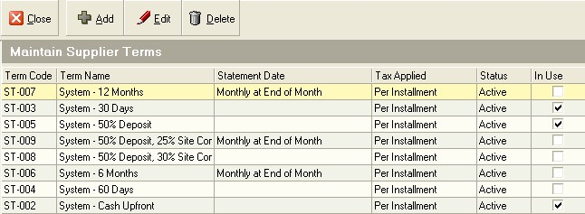
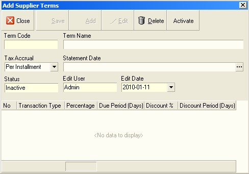
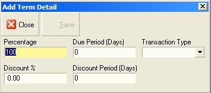

## Step-by-step Guideline
___
This procedure describes how you can record details of payments that
have been made to suppliers in the Sense-I System so that the reports
displaying outstanding supplier balances and cash flow reports are
accurate.

1.  Click on the Supplier Item on the Main Menu.

2.  Click on the Settings Menu Item on the drop down menu.  

3.  Click on the Supplier Terms Menu Item from the side pop-up menu.

The system will display a screen titled Maintain Supplier Terms. This
screen lists all of the Payment Terms that have been previously defined
for Supplier Accounts and captured in the system.

4.  To Add a new Supplier Payment Term to the database, click the Add
    button on the form bar.

The system will display a screen titled Add Supplier Terms. This screen
allows you to define a new Payment Term and save this in the system
database.

5.  Type in a name that describes the details of the payment terms.

6.  Decide when the Tax due on the transaction is to be applied. Either
    this is as each instalment is paid or all the tax is applied on the
    final instalment. Select the appropriate option from the drop down
    list in the Tax Accrual field.

7.  If the payment terms are based on a statement date, then define the
    date on which the statement is received. For example, the 25th of
    each month. If the payment terms are based on a number of days from
    the invoice date, then leave this field blank.

8.  Click the Save button, then click the Add button.

The system will open a screen title Add Term Detail. This screen
enables you to enter information about the terms that are used by the
system to calculate the cash flow for all supplier payments.

Supplier payment terms consist of the following

9.  Percentage of total transaction value payable.

10. The number of days from the transaction date (either order, invoice
    or statement) by which the percentage payable must be paid.

11. The transaction on which the delay to the payment date is
    calculated.

12. If any discount is granted when the payment is made, then the
    percentage discount given is entered in this field.

13. The number of days within which payment must be made for the
    discount to be allowed.

As an example, assume the terms are 30%, 5 days from Order. In other
words, if you placed an order for R 3,000 with a supplier on the 18th of
January, you would need to make a payment of R 1,000 on 5 days later, on
the 23rd of January. This is essential if you transact with suppliers
who require a deposit or partial payment when you purchase goods or
services from them. Most suppliers will apply simple terms such as 100%,
30 days from statement. In this case on the 28th of February you would
need to pay the full R 3,000.

14. Once you have entered all the details about the terms click the Save
    button on the form bar.

-   If the payment terms are based on a statement, then the date on
    which the statement is normally run is entered in this field. If the
    payment terms are based on the date of order or invoice, then this
    field is left blank.

-   Payment Split (If the supplier terms allow you or require you to pay
    a percentage on order, and a different percentage on delivery and
    then maybe on statement, you can enter this information in this
    field.)

-   Tax (If the Tax is payable on each portion of the transaction then
    leave the Tax block blank. If Tax is only payable on the last
    transaction, then place a tick in this block.)

**This is the end of this procedure.**
