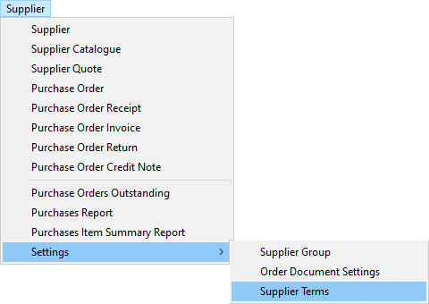
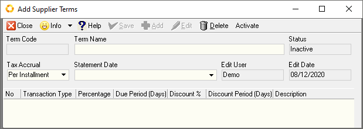
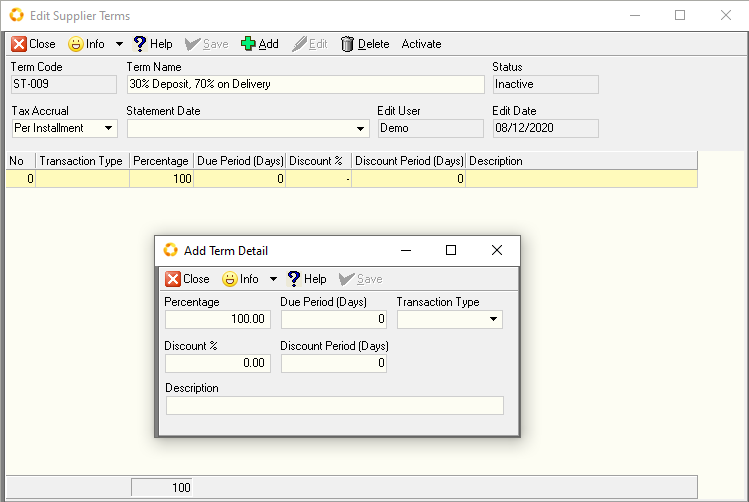
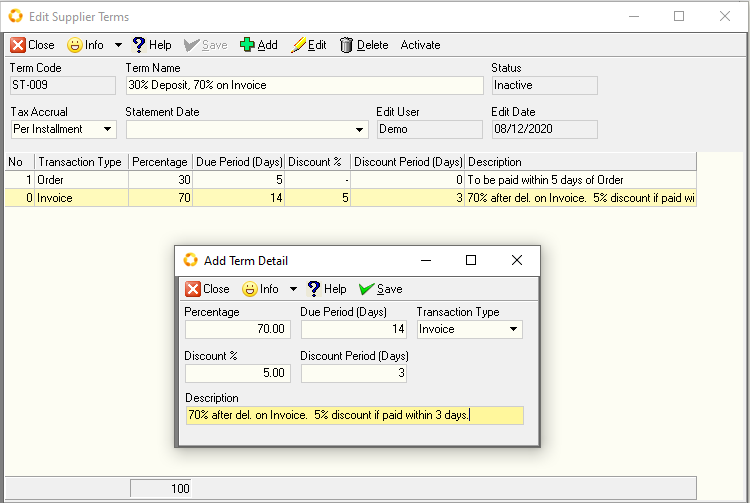

## Step-by-step Guideline
___
This procedure describes how you can record details of payments that
have been made to suppliers in the Sense-i System so that the reports
displaying outstanding supplier balances and cash flow reports are
accurate.

1.  Click on the **Supplier** item on the Main Menu.  

2.  Click on the **Settings** item on the drop down menu.  

3.  Click on the **Supplier Terms** menu item from the side pop-up menu.  

  

The system will display a screen titled **Maintain Supplier Terms**.  
This screen lists all of the Payment Terms that have been previously defined
for Supplier Accounts and captured in the system.  

  

## Add Supplier Payment Terms  

1.  To Add a new Supplier Payment Term to the database, click the **Add**
    button on the form bar.  

The system will display a screen titled **Add Supplier Terms**.  
This screen allows you to define a new Payment Term to be saved in the system
database.  

2.  In the **Term Name** field type in a name that describes the details of the 
	payment terms.  

1.  Decide when the **Tax** due on the transaction is to be applied. Either
    this is as **each installment** is paid or all the tax is applied on the
    **final installment**. Select the appropriate option from the drop down
    list in the **Tax Accrual** field.  

1.  If the payment terms are based on a **statement date**, then define the
    date on which the statement is received. For example, the 25th of
    each month. 
	If the payment terms are based on a number of days from
    the invoice date, then leave this field blank.  

1.  Click the **Save** button.  

### Specify Term Detail

1.  To specify the Term details, click the **Add** button.

The system will open a screen titled **Add Term Detail**. This screen
enables you to enter information about the terms that are used by the
system to calculate the cash flow for all supplier payments.  

  

Supplier payment terms consist of the following

2.  **Percentage** of total transaction value payable.

1. The number of **days** from the transaction date (either **order**, **invoice**
    or **statement**) by which the percentage payable must be paid.

1. The **Transaction Type** on which the delay to the payment date is
    calculated.

1. If any discount is granted when the payment is made, then the
    **percentage discount** given is entered in this field.

1. The number of days _**(Discount Period - Days)**_ within which payment must be made for the
    discount to be applied.  
	
Most suppliers will apply simple terms such as 100%, 30 days from statement.  

As an example, assume the terms are 30%, 5 days from Order.  
In other words, if you placed an order for R 3,000 with a supplier on the 18th of
January, you would need to make a payment of R900 within 5 days, on/before
the 23rd of January.  
This is essential if you transact with suppliers who require a deposit or 
partial payment when you purchase goods or services from them.  

  

In this example the outstanding amount of R2,100 would need to be paid within 14 days
from the date of invoice. 

:::note
If the invoice is settled within 3 days a discount of 5% would apply.
::: 

7. Once you have entered all the details about the terms click the **Save**
    button on the form bar.

### Transaction Type

-   If the payment terms are based on a statement, then the date on
    which the statement is normally run is entered in this field. If the
    payment terms are based on the date of order or invoice, then this
    field is left blank.

-   Payment Split (If the supplier terms allow you or require you to pay
    a percentage on order, and a different percentage on delivery and
    then maybe on statement, you can enter this information in this
    field.)

-   Tax (If the Tax is payable on each portion of the transaction then
    leave the Tax block blank. If Tax is only payable on the last
    transaction, then place a tick in this block.)

**This is the end of this procedure.**
